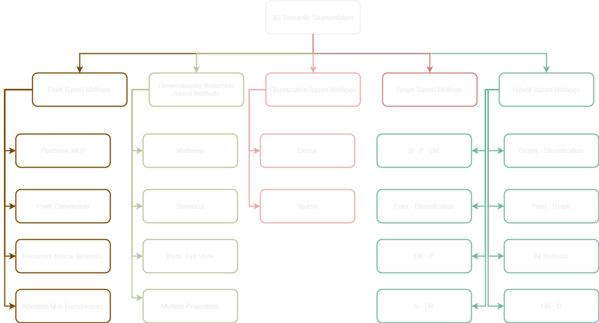

<h1>Deep Learning on 3D Semantic Segmentation: a Detailed Review</h1>

This repo contains a quick classification of over 400 3D Semantic Segmentation papers using the Taxonomy Scheme proposed in the Deep Learning on 3D Semantic Segmentation: a Detailed Review paper 

<h2> Abstract </h2>

 In this paper an exhaustive review and comprehensive analysis of recent and former deep learning methods in
3D Semantic Segmentation (3DSS) is presented. In the related literature, the taxonomy scheme used for the
classification of the 3DSS deep learning methods is ambiguous. Based on the taxonomy schemes of 9 existing review
papers, a new taxonomy scheme of the 3DSS deep learning methods is proposed, aiming to standardize it and
improve the comparability and clarity across related studies. Furthermore, an extensive overview of the available
3DSS indoor and outdoor datasets is provided along with their links. The core part of the review is the detailed
presentation of recent and former 3DSS deep learning methods and their classification using the proposed taxonomy
scheme along with their GitHub repositories. Additionally, a brief but informative analysis of the evaluation metrics
and loss functions used in 3DSS is included. Finally, a fruitful discussion of the examined 3DSS methods and datasets,
is presented to foster new research directions and applications in the field of 3DSS. Supplementary, to this review a
GitHub repository is provided (https://github.com/thobet/Deep-Learning-on-3D-Semantic-Segmentation-a-Detailed-Review) 
including a quick classification of over 400 3DSS methods, using the proposed taxonomy scheme. 

Please find the preprint at [arXiv]()

<h2> 3D Semantic Segmentation Taxonomy Scheme</h2>

Abbreviations: Attention Mechanism and Transformers (Attention M. & Transformers), Discretization Based Methods (D), Dimensionality Reduction Based
Methods (DR), Graph Based Methods (G), Point Based Methods (P)

# 3D Semantic Segmentation

## Point Based methods

The Point Based Methods use the raw 3D points to extract meaningful features for 3DSS. The following table present the collected papers of the Point-Based methods:

|     |   Publication Year | Author                                                                                                                                 | Title                                                                                                                                                                                                                                                                                                                                                                                           | Code   |
|----:|-------------------:|:---------------------------------------------------------------------------------------------------------------------------------------|:------------------------------------------------------------------------------------------------------------------------------------------------------------------------------------------------------------------------------------------------------------------------------------------------------------------------------------------------------------------------------------------------|:-------|
|   0 |               2017 | Charles, R. Qi; Su, Hao; Kaichun, Mo; Guibas, Leonidas J.                                                                              | [PointNet: Deep Learning on Point Sets for 3D Classification and Segmentation](http://ieeexplore.ieee.org/document/8099499/)                                                                                                                                                                                                                                                                    |        |
|   1 |               2017 | Qi, Charles Ruizhongtai; Yi, Li; Su, Hao; Guibas, Leonidas J                                                                           | [PointNet++: Deep Hierarchical Feature Learning on Point Sets in a Metric Space]()                                                                                                                                                                                                                                                                                                              |        |
|  14 |               2017 | Engelmann, Francis; Kontogianni, Theodora; Hermans, Alexander; Leibe, Bastian                                                          | [Exploring Spatial Context for 3D Semantic Segmentation of Point Clouds](https://openaccess.thecvf.com/content_ICCV_2017_workshops/w13/html/Engelmann_Exploring_Spatial_Context_ICCV_2017_paper.html)                                                                                                                                                                                           |        |
|  28 |               2018 | Hermosilla, Pedro; Ritschel, Tobias; Vázquez, Pere-Pau; Vinacua, Àlvar; Ropinski, Timo                                                 | [Monte carlo convolution for learning on non-uniformly sampled point clouds]()                                                                                                                                                                                                                                                                                                                  |        |
|  27 |               2018 | Atzmon, Matan; Maron, Haggai; Lipman, Yaron                                                                                            | [Point convolutional neural networks by extension operators]()                                                                                                                                                                                                                                                                                                                                  |        |
|  31 |               2018 | Shen, Yiru; Feng, Chen; Yang, Yaoqing; Tian, Dong                                                                                      | [Mining point cloud local structures by kernel correlation and graph pooling]()                                                                                                                                                                                                                                                                                                                 |        |
|  32 |               2018 | Wang, Shenlong; Suo, Simon; Ma, Wei-Chiu; Pokrovsky, Andrei; Urtasun, Raquel                                                           | [Deep parametric continuous convolutional neural networks]()                                                                                                                                                                                                                                                                                                                                    |        |
|  33 |               2018 | Groh, Fabian; Wieschollek, Patrick; Lensch, Hendrik P. A.                                                                              | [Flex-Convolution (Million-Scale Point-Cloud Learning Beyond Grid-Worlds)](http://arxiv.org/abs/1803.07289)                                                                                                                                                                                                                                                                                     |        |
|  23 |               2018 | Li, Yangyan; Bu, Rui; Sun, Mingchao; Wu, Wei; Di, Xinhan; Chen, Baoquan                                                                | [PointCNN: Convolution On X-Transformed Points]()                                                                                                                                                                                                                                                                                                                                               |        |
|  34 |               2018 | Li, Jiaxin; Chen, Ben M.; Lee, Gim Hee                                                                                                 | [So-net: Self-organizing network for point cloud analysis]()                                                                                                                                                                                                                                                                                                                                    |        |
|  35 |               2018 | Xie, Saining; Liu, Sainan; Chen, Zeyu; Tu, Zhuowen                                                                                     | [Attentional shapecontextnet for point cloud recognition]()                                                                                                                                                                                                                                                                                                                                     |        |
|  36 |               2018 | Rethage, Dario; Wald, Johanna; Sturm, Jurgen; Navab, Nassir; Tombari, Federico                                                         | [Fully-convolutional point networks for large-scale point clouds]()                                                                                                                                                                                                                                                                                                                             |        |
|  29 |               2018 | Hua, Binh-Son; Tran, Minh-Khoi; Yeung, Sai-Kit                                                                                         | [Pointwise convolutional neural networks]()                                                                                                                                                                                                                                                                                                                                                     |        |
|  30 |               2018 | Xu, Yifan; Fan, Tianqi; Xu, Mingye; Zeng, Long; Qiao, Yu                                                                               | [Spidercnn: Deep learning on point sets with parameterized convolutional filters]()                                                                                                                                                                                                                                                                                                             |        |
| 125 |               2018 | Huang, Qiangui; Wang, Weiyue; Neumann, Ulrich                                                                                          | [Recurrent Slice Networks for 3D Segmentation of Point Clouds](http://arxiv.org/abs/1802.04402)                                                                                                                                                                                                                                                                                                 |        |
|   6 |               2018 | Ye, Xiaoqing; Li, Jiamao; Huang, Hexiao; Du, Liang; Zhang, Xiaolin                                                                     | [3D Recurrent Neural Networks with Context Fusion for Point Cloud Semantic Segmentation](http://link.springer.com/10.1007/978-3-030-01234-2_25)                                                                                                                                                                                                                                                 |        |
|  58 |               2018 | Jiang, Mingyang; Wu, Yiran; Zhao, Tianqi; Zhao, Zelin; Lu, Cewu                                                                        | [Pointsift: A sift-like network module for 3d point cloud semantic segmentation]()                                                                                                                                                                                                                                                                                                              |        |
| 131 |               2018 | Ma, Yanxin; Guo, Yulan; Lei, Yinjie; Lu, Min; Zhang, Jun                                                                               | [3DMAX-Net: A Multi-Scale Spatial Contextual Network for 3D Point Cloud Semantic Segmentation](https://ieeexplore.ieee.org/document/8546281/)                                                                                                                                                                                                                                                   |        |
|  71 |               2019 | Komarichev, Artem; Zhong, Zichun; Hua, Jing                                                                                            | [A-CNN: Annularly Convolutional Neural Networks on Point Clouds](https://ieeexplore.ieee.org/document/8953826/)                                                                                                                                                                                                                                                                                 |        |
|  86 |               2019 | Kong, Xin; Zhai, Guangyao; Zhong, Baoquan; Liu, Yong                                                                                   | [PASS3D: Precise and Accelerated Semantic Segmentation for 3D Point Cloud](http://arxiv.org/abs/1909.01643)                                                                                                                                                                                                                                                                                     |        |
|  87 |               2019 | Abdou, Mohammed; Elkhateeb, Mahmoud; Sobh, Ibrahim; Elsallab, Ahmad                                                                    | [End-to-End 3D-PointCloud Semantic Segmentation for Autonomous Driving](http://arxiv.org/abs/1906.10964)                                                                                                                                                                                                                                                                                        |        |
|  62 |               2019 | Mao, Jiageng; Wang, Xiaogang; Li, Hongsheng                                                                                            | [Interpolated Convolutional Networks for 3D Point Cloud Understanding](https://ieeexplore.ieee.org/document/9010291/)                                                                                                                                                                                                                                                                           |        |
|  56 |               2019 | Pham, Quang-Hieu; Nguyen, Thanh; Hua, Binh-Son; Roig, Gemma; Yeung, Sai-Kit                                                            | [Jsis3d: Joint semantic-instance segmentation of 3d point clouds with multi-task pointwise networks and multi-value conditional random fields]()                                                                                                                                                                                                                                                |        |
|  59 |               2019 | Zhao, Zongyue; Liu, Min; Ramani, Karthik                                                                                               | [DAR-Net: Dynamic aggregation network for semantic scene segmentation]()                                                                                                                                                                                                                                                                                                                        |        |
|  79 |               2019 | Kumar, Ashutosh; Anders, Katharina; Winiwarter, Lukas; Höfle, Bernhard                                                                 | [Feature relevance analysis for 3D point cloud classification using deep learning]()                                                                                                                                                                                                                                                                                                            |        |
|  38 |               2019 | Liu, Yongcheng; Fan, Bin; Xiang, Shiming; Pan, Chunhong                                                                                | [Relation-Shape Convolutional Neural Network for Point Cloud Analysis](https://ieeexplore.ieee.org/document/8953930/)                                                                                                                                                                                                                                                                           |        |
|  39 |               2019 | Zhang, Zhiyuan; Hua, Binh-Son; Yeung, Sai-Kit                                                                                          | [ShellNet: Efficient Point Cloud Convolutional Neural Networks Using Concentric Shells Statistics](https://ieeexplore.ieee.org/document/9010996/)                                                                                                                                                                                                                                               |        |
| 102 |               2019 | Liu, Xinhai; Han, Zhizhong; Liu, Yu-Shen; Zwicker, Matthias                                                                            | [Point2sequence: Learning the shape representation of 3d point clouds with an attention-based sequence to sequence network]()                                                                                                                                                                                                                                                                   |        |
|  57 |               2019 | Chen, Lin-Zhuo; Li, Xuan-Yi; Fan, Deng-Ping; Wang, Kai; Lu, Shao-Ping; Cheng, Ming-Ming                                                | [LSANet: Feature learning on point sets by local spatial aware layer]()                                                                                                                                                                                                                                                                                                                         |        |
|  55 |               2019 | Liu, Xingyu; Yan, Mengyuan; Bohg, Jeannette                                                                                            | [Meteornet: Deep learning on dynamic 3d point cloud sequences]()                                                                                                                                                                                                                                                                                                                                |        |
|  41 |               2019 | Wang, Xinlong; Liu, Shu; Shen, Xiaoyong; Shen, Chunhua; Jia, Jiaya                                                                     | [Associatively Segmenting Instances and Semantics in Point Clouds](http://arxiv.org/abs/1902.09852)                                                                                                                                                                                                                                                                                             |        |
| 103 |               2019 | Malinverni, E. S.; Pierdicca, R.; Paolanti, M.; Martini, M.; Morbidoni, C.; Matrone, F.; Lingua, A.                                    | [DEEP LEARNING FOR SEMANTIC SEGMENTATION OF 3D POINT CLOUD](https://isprs-archives.copernicus.org/articles/XLII-2-W15/735/2019/)                                                                                                                                                                                                                                                                |        |
|  75 |               2019 | Zhang, Zhiyuan; Hua, Binh-Son; Rosen, David W.; Yeung, Sai-Kit                                                                         | [Rotation Invariant Convolutions for 3D Point Clouds Deep Learning](http://arxiv.org/abs/1908.06297)                                                                                                                                                                                                                                                                                            |        |
| 107 |               2019 | Zhao, Hengshuang; Jiang, Li; Fu, Chi-Wing; Jia, Jiaya                                                                                  | [PointWeb: Enhancing Local Neighborhood Features for Point Cloud Processing](https://ieeexplore.ieee.org/document/8954075/)                                                                                                                                                                                                                                                                     |        |
| 106 |               2019 | Zhao, Chenxi; Zhou, Weihao; Lu, Li; Zhao, Qijun                                                                                        | [Pooling Scores of Neighboring Points for Improved 3D Point Cloud Segmentation](https://ieeexplore.ieee.org/document/8803048/)                                                                                                                                                                                                                                                                  |        |
|  21 |               2019 | Choy, Christopher; Gwak, JunYoung; Savarese, Silvio                                                                                    | [4D Spatio-Temporal ConvNets: Minkowski Convolutional Neural Networks](https://ieeexplore.ieee.org/document/8953494/)                                                                                                                                                                                                                                                                           |        |
|   2 |               2019 | Wu, Wenxuan; Qi, Zhongang; Fuxin, Li                                                                                                   | [PointConv: Deep Convolutional Networks on 3D Point Clouds]()                                                                                                                                                                                                                                                                                                                                   |        |
| 108 |               2019 | Lei, Huan; Akhtar, Naveed; Mian, Ajmal                                                                                                 | [Octree Guided CNN With Spherical Kernels for 3D Point Clouds](https://ieeexplore.ieee.org/document/8953410/)                                                                                                                                                                                                                                                                                   |        |
|  10 |               2019 | Engelmann, Francis; Kontogianni, Theodora; Schult, Jonas; Leibe, Bastian                                                               | [Know What Your Neighbors Do: 3D Semantic Segmentation of Point Clouds](http://link.springer.com/10.1007/978-3-030-11015-4_29)                                                                                                                                                                                                                                                                  |        |
|  17 |               2019 | Thomas, Hugues; Qi, Charles R.; Deschaud, Jean-Emmanuel; Marcotegui, Beatriz; Goulette, François; Guibas, Leonidas J.                  | [KPConv: Flexible and Deformable Convolution for Point Clouds](http://arxiv.org/abs/1904.08889)                                                                                                                                                                                                                                                                                                 |        |
|  26 |               2019 | Chen, Weikai; Han, Xiaoguang; Li, Guanbin; Chen, Chao; Xing, Jun; Zhao, Yajie; Li, Hao                                                 | [Deep RBFNet: Point Cloud Feature Learning using Radial Basis Functions](http://arxiv.org/abs/1812.04302)                                                                                                                                                                                                                                                                                       |        |
| 133 |               2019 | Fan, Hehe; Yang, Yi                                                                                                                    | [PointRNN: Point Recurrent Neural Network for Moving Point Cloud Processing](http://arxiv.org/abs/1910.08287)                                                                                                                                                                                                                                                                                   |        |
|  89 |               2020 | Wu, Guangnan; Pan, Zhiyi; Jiang, Peng; Tu, Changhe                                                                                     | [Bi-Directional Attention for Joint Instance and Semantic Segmentation in Point Clouds](http://arxiv.org/abs/2003.05420)                                                                                                                                                                                                                                                                        |        |
|  88 |               2020 | Wong, Chi-Chong; Vong, Chi-Man                                                                                                         | [Efficient Outdoor 3D Point Cloud Semantic Segmentation for Critical Road Objects and Distributed Contexts](https://link.springer.com/10.1007/978-3-030-58583-9_30)                                                                                                                                                                                                                             |        |
|   3 |               2020 | Heng Zhou, Zhijun Fang, Yongbin Gao, Bo Huang, Cengsi Zhong, Ruoxi Shang                                                               | [Feature fusion network based on attention mechanism for 3D semantic segmentation of point clouds](https://reader.elsevier.com/reader/sd/pii/S0167865520300994?token=CF03F83A0383C0205D89542F5539B16FEDB0758693C52909EDCB9F57484DE35E6D2BB804F163CB802E26EDB47C74C6B7&originRegion=eu-west-1&originCreation=20220919075450)                                          |        |
|  85 |               2020 | Zhang, Jiazhao; Zhu, Chenyang; Zheng, Lintao; Xu, Kai                                                                                  | [Fusion-aware point convolution for online semantic 3d scene segmentation]()                                                                                                                                                                                                                                                                                                                    |        |
|  84 |               2020 | He, Tong; Gong, Dong; Tian, Zhi; Shen, Chunhua                                                                                         | [Learning and memorizing representative prototypes for 3d point cloud semantic and instance segmentation]()                                                                                                                                                                                                                                                                                     |        |
|  83 |               2020 | Engelmann, Francis; Kontogianni, Theodora; Leibe, Bastian                                                                              | [Dilated point convolutions: On the receptive field size of point convolutions on 3d point clouds]()                                                                                                                                                                                                                                                                                            |        |
|  80 |               2020 | Fang, Yuan; Xu, Chunyan; Cui, Zhen; Zong, Yuan; Yang, Jian                                                                             | [Spatial Transformer Point Convolution](http://arxiv.org/abs/2009.01427)                                                                                                                                                                                                                                                                                                                        |        |
|  63 |               2020 | Liu, Ze; Hu, Han; Cao, Yue; Zhang, Zheng; Tong, Xin                                                                                    | [A Closer Look at Local Aggregation Operators in Point Cloud Analysis](https://link.springer.com/10.1007/978-3-030-58592-1_20)                                                                                                                                                                                                                                                                  |        |
|  92 |               2020 | Cheng, Mingmei; Hui, Le; Xie, Jin; Yang, Jian; Kong, Hui                                                                               | [Cascaded Non-local Neural Network for Point Cloud Semantic Segmentation](http://arxiv.org/abs/2007.15488)                                                                                                                                                                                                                                                                                      |        |
|  91 |               2020 | Wang, Guangming; Yang, Yehui; Zhang, Huixin; Liu, Zhe; Wang, Hesheng                                                                   | [Spherical Interpolated Convolutional Network with Distance-Feature Density for 3D Semantic Segmentation of Point Clouds](http://arxiv.org/abs/2011.13784)                                                                                                                                                                                                                                      |        |
|  50 |               2020 | Yan, Xu; Zheng, Chaoda; Li, Zhen; Wang, Sheng; Cui, Shuguang                                                                           | [Pointasnl: Robust point clouds processing using nonlocal neural networks with adaptive sampling]()                                                                                                                                                                                                                                                                                             |        |
|  15 |               2020 | Hu, Qingyong; Yang, Bo; Xie, Linhai; Rosa, Stefano; Guo, Yulan; Wang, Zhihua; Trigoni, Niki; Markham, Andrew                           | [RandLA-Net: Efficient Semantic Segmentation of Large-Scale Point Clouds](http://arxiv.org/abs/1911.11236)                                                                                                                                                                                                                                                                                      |        |
|  42 |               2020 | Wei, Jiacheng; Lin, Guosheng; Yap, Kim-Hui; Hung, Tzu-Yi; Xie, Lihua                                                                   | [Multi-Path Region Mining For Weakly Supervised 3D Semantic Segmentation on Point Clouds](http://arxiv.org/abs/2003.13035)                                                                                                                                                                                                                                                                      |        |
|  43 |               2020 | Hu, Zeyu; Zhen, Mingmin; Bai, Xuyang; Fu, Hongbo; Tai, Chiew-lan                                                                       | [JSENet: Joint Semantic Segmentation and Edge Detection Network for 3D Point Clouds](http://arxiv.org/abs/2007.06888)                                                                                                                                                                                                                                                                           |        |
| 105 |               2021 | Liu, Hao; Guo, Yulan; Ma, Yanni; Lei, Yinjie; Wen, Gongjian                                                                            | [Semantic Context Encoding for Accurate 3D Point Cloud Segmentation]()                                                                                                                                                                                                                                                                                                                          |        |
|  72 |               2021 | Boulch, Alexandre; Puy, Gilles; Marlet, Renaud                                                                                         | [FKAConv: Feature-Kernel Alignment for Point Cloud Convolution](http://link.springer.com/10.1007/978-3-030-69525-5_23)                                                                                                                                                                                                                                                                          |        |
| 111 |               2021 | Engel, Nico; Belagiannis, Vasileios; Dietmayer, Klaus                                                                                  | [Point Transformer Engel]()                                                                                                                                                                                                                                                                                                                                                                     |        |
|  45 |               2021 | Su, Yanfei; Liu, Weiquan; Yuan, Zhimin; Cheng, Ming; Zhang, Zhihong; Shen, Xuelun; Wang, Cheng                                         | [DLA-Net: Learning Dual Local Attention Features for Semantic Segmentation of Large-Scale Building Facade Point Clouds](http://arxiv.org/abs/2106.00376)                                                                                                                                                                                                                                        |        |
|  44 |               2021 | Xu, Mingye; Zhou, Zhipeng; Zhang, Junhao; Qiao, Yu                                                                                     | [Investigate Indistinguishable Points in Semantic Segmentation of 3D Point Cloud](http://arxiv.org/abs/2103.10339)                                                                                                                                                                                                                                                                              |        |
|  20 |               2021 | Zhao, Hengshuang; Jiang, Li; Jia, Jiaya; Torr, Philip H S; Koltun, Vladlen                                                             | [Point Transformer Zhao]()                                                                                                                                                                                                                                                                                                                                                                      |        |
|  93 |               2021 | Lu, Tao; Wang, Limin; Wu, Gangshan                                                                                                     | [CGA-Net: Category Guided Aggregation for Point Cloud Semantic Segmentation](https://ieeexplore.ieee.org/document/9577467/)                                                                                                                                                                                                                                                                     |        |
|  90 |               2021 | Yi, Li; Gong, Boqing; Funkhouser, Thomas                                                                                               | [Complete & Label: A Domain Adaptation Approach to Semantic Segmentation of LiDAR Point Clouds](http://arxiv.org/abs/2007.08488)                                                                                                                                                                                                                                                                |        |
|  81 |               2021 | Qiu, Shi; Anwar, Saeed; Barnes, Nick                                                                                                   | [Dense-Resolution Network for Point Cloud Classification and Segmentation](https://ieeexplore.ieee.org/document/9423047/)                                                                                                                                                                                                                                                                       |        |
|  16 |               2021 | Liu, Kangcheng; Gao, Zhi; Lin, Feng; Chen, Ben M.                                                                                      | [FG-Net: Fast Large-Scale LiDAR Point Clouds Understanding Network Leveraging Correlated Feature Mining and Geometric-Aware Modelling](http://arxiv.org/abs/2012.09439)                                                                                                                                                                                                                         |        |
|  18 |               2021 | Qiu, Shi; Anwar, Saeed; Barnes, Nick                                                                                                   | [Semantic Segmentation for Real Point Cloud Scenes via Bilateral Augmentation and Adaptive Fusion](https://ieeexplore.ieee.org/document/9577557/)                                                                                                                                                                                                                                               |        |
|  19 |               2021 | Fan, Siqi; Dong, Qiulei; Zhu, Fenghua; Lv, Yisheng; Ye, Peijun; Wang, Fei-Yue                                                          | [SCF-Net: Learning Spatial Contextual Features for Large-Scale Point Cloud Segmentation](https://ieeexplore.ieee.org/document/9577763/)                                                                                                                                                                                                                                                         |        |
|  82 |               2021 | Yin, Chao; Wang, Boyu; Gan, Vincent J.L.; Wang, Mingzhu; Cheng, Jack C.P.                                                              | [Automated semantic segmentation of industrial point clouds using ResPointNet++](https://linkinghub.elsevier.com/retrieve/pii/S0926580521003253)                                                                                                                                                                                                                                                |        |
|  96 |               2022 | Chen, Minghong; Zhang, Guanghui; Shi, Wenjun; Zhu, Dongchen; Zhang, Xiaolin; Li, Jiamao                                                | [Dual-Neighborhood Feature Aggregation Network for Point Cloud Semantic Segmentation]()                                                                                                                                                                                                                                                                                                         |        |
|  94 |               2022 | Luo, Chuanyu; Li, Xiaohan; Cheng, Nuo; Li, Han; Lei, Shengguang; Li, Pu                                                                | [MVP-Net: Multiple View Pointwise Semantic Segmentation of Large-Scale Point Clouds](http://arxiv.org/abs/2201.12769)                                                                                                                                                                                                                                                                           |        |
| 132 |               2022 | Ma, Xu; Qin, Can; You, Haoxuan; Ran, Haoxi; Fu, Yun                                                                                    | [Rethinking Network Design and Local Geometry in Point Cloud: A Simple Residual MLP Framework](http://arxiv.org/abs/2202.07123)                                                                                                                                                                                                                                                                 |        |
|  97 |               2022 | Pan, Jieyun; Cao, Kun; Zhao, Bingxin; Li, Weihong; Zhang, Tianyang                                                                     | [Semantic Segmentation of Large-Scale Point Clouds by Encoder-Decoder Shared MLPs with Weighted Focal Loss]()                                                                                                                                                                                                                                                                                   |        |
| 109 |               2022 | Du, C; Torres, M A Vega; Pan, Y; Borrmann, A                                                                                           | [MV-KPConv: Multi-view KPConv For Enhanced 3D Point Cloud Semantic Segmentation Using Multi-Modal Fusion With 2D Images]()                                                                                                                                                                                                                                                                      |        |
|  95 |               2022 | Li, Mengtian; Xie, Yuan; Shen, Yunhang; Ke, Bo; Qiao, Ruizhi; Ren, Bo; Lin, Shaohui; Ma, Lizhuang                                      | [HybridCR: Weakly-Supervised 3D Point Cloud Semantic Segmentation via Hybrid Contrastive Regularization](https://ieeexplore.ieee.org/document/9879771/)                                                                                                                                                                                                                                         |        |
| 104 |               2022 | Zheng, Yu; Xu, Xiuwei; Zhou, Jie; Lu, Jiwen                                                                                            | [PointRas: Uncertainty-Aware Multi-Resolution Learning for Point Cloud Segmentation]()                                                                                                                                                                                                                                                                                                          |        |
|  67 |               2022 | Xiangda Lei a, Haiyan Guan a, Lingfei Ma, Yongtao Yu, Zhen Dong, Kyle Gao, Mahmoud Reza Delavar, Jonathan Li                           | [WSPointNet: A multi-branch weakly supervised learning network for semantic segmentation of large-scale mobile laser scanning point clouds](https://reader.elsevier.com/reader/sd/pii/S156984322200317X?token=496FB02073E2158EF51C5F27162D84FFE7AA7083C5803333D25D385CBF6E701AA9AA9D86CF504002843EA6E953F1D2EA&originRegion=eu-west-1&originCreation=20230418115051) |        |
|  22 |               2022 | Wu, Xiaoyang; Lao, Yixing; Jiang, Li; Liu, Xihui; Zhao, Hengshuang                                                                     | [Point Transformer V2: Grouped Vector Attention and Partition-based Pooling](http://arxiv.org/abs/2210.05666)                                                                                                                                                                                                                                                                                   |        |
|   9 |               2022 | Miao, Zhiqing; Song, Shaojing; Tang, Pan; Chen, Jian; Hu, Jinyan; Gong, Yumei                                                          | [MFFRand: Semantic Segmentation of Point Clouds Based on Multi-Scale Feature Fusion and Multi-Loss Supervision](https://www.mdpi.com/2079-9292/11/21/3626)                                                                                                                                                                                                                                      |        |
|  48 |               2022 | Huang, Wenhua; Zhu, Lei; Wang, Wenwu                                                                                                   | [Semantic Segmentation for Point Cloud based on Distance Weighted and Adaptive Augmentation]()                                                                                                                                                                                                                                                                                                  |        |
|  51 |               2022 | Yaping Lin, George Vosselman, Michael Ying Yang                                                                                        | [Weakly supervised semantic segmentation of airborne laser scanning point clouds](https://reader.elsevier.com/reader/sd/pii/S0924271622000661?token=48F9DDC8E07C67DC3DB0D91A8E153116DB58C786FDC3790BA3E928CD84BB3C00F54651F253A061A53BA45801372D9846&originRegion=eu-west-1&originCreation=20230321140105)                                                           |        |
|   8 |               2022 | Su, Zhonghua; Zhou, Guiyun; Luo, Fulin; Li, Shihua; Ma, Kai-Kuang                                                                      | [Semantic Segmentation of 3D Point Clouds Based on High Precision Range Search Network](https://www.mdpi.com/2072-4292/14/22/5649)                                                                                                                                                                                                                                                              |        |
|  64 |               2022 | Qian, Guocheng; Li, Yuchen; Peng, Houwen; Mai, Jinjie; Hammoud, Hasan; Elhoseiny, Mohamed; Ghanem, Bernard                             | [Pointnext: Revisiting pointnet++ with improved training and scaling strategies]()                                                                                                                                                                                                                                                                                                              |        |
|  12 |               2022 | Du, Shenglan; Ibrahimli, Nail; Stoter, Jantien; Kooij, Julian; Nan, Liangliang                                                         | [Push-the-Boundary: Boundary-aware Feature Propagation for Semantic Segmentation of 3D Point Clouds](http://arxiv.org/abs/2212.12402)                                                                                                                                                                                                                                                           |        |
|   4 |               2022 | Zhang, Ka; Ye, Longjie; Xiao, Wen; Sheng, Yehua; Zhang, Shan; Tao, Xia; Zhou, Yaqin                                                    | [A Dual Attention Neural Network for Airborne LiDAR Point Cloud Semantic Segmentation]()                                                                                                                                                                                                                                                                                                        |        |
|  69 |               2022 | Liao, Kuan-Yu; Xiao, You-Sheng; Fan, Yu-Cheng                                                                                          | [3D Point Cloud Semantic Segmentation System](https://dl.acm.org/doi/10.1145/3556223.3556233)                                                                                                                                                                                                                                                                                                   |        |
|   7 |               2022 | Wysocki, O.; Grilli, E.; Hoegner, L.; Stilla, U.                                                                                       | [COMBINING VISIBILITY ANALYSIS AND DEEP LEARNING FOR REFINEMENT OF SEMANTIC 3D BUILDING MODELS BY CONFLICT CLASSIFICATION](https://www.isprs-ann-photogramm-remote-sens-spatial-inf-sci.net/X-4-W2-2022/289/2022/)                                                                                                                                                                              |        |
|   5 |               2022 | Song, Yupeng; He, Fazhi; Duan, Yansong; Si, Tongzhen; Bai, Junwei                                                                      | [LSLPCT: An Enhanced Local Semantic Learning Transformer for 3D Point Cloud Analysis]()                                                                                                                                                                                                                                                                                                         |        |
|  68 |               2022 | Qi Chen, Zhenxin Zhang, Siyun Chen, Siyuan Wen, Hao Ma, Zhihua Xu                                                                      | [A self-attention based global feature enhancing network for semantic segmentation of large-scale urban street-level point clouds](https://reader.elsevier.com/reader/sd/pii/S1569843222001662?token=9A163EBA2BFF26B9E924FF0228D906B3F94F9B500368DB8A8EB846153F37CB11ED44C2352737EE5E4C4158A250AEF15A&originRegion=eu-west-1&originCreation=20230418115053)          |        |
| 129 |               2023 | Xue, Le; Gao, Mingfei; Xing, Chen; Martín-Martín, Roberto; Wu, Jiajun; Xiong, Caiming; Xu, Ran; Niebles, Juan Carlos; Savarese, Silvio | [ULIP: Learning a Unified Representation of Language, Images, and Point Clouds for 3D Understanding](https://ieeexplore.ieee.org/document/10203465/)                                                                                                                                                                                                                                            |        |
| 110 |               2023 | Shen, Shuo; Xia, Yan; Eich, Andreas; Xu, Yusheng; Yang, Bisheng; Stilla, Uwe                                                           | [SegTrans: Semantic Segmentation with Transfer Learning for MLS Point Clouds](https://ieeexplore.ieee.org/document/10179997/)                                                                                                                                                                                                                                                                   |        |
| 112 |               2023 | Artopoulos, Georgios; Maslioukova, Maria I.; Zavou, Christina; Loizou, Marios; Deligiorgi, Marissia; Averkiou, Melinos                 | [An artificial neural network framework for classifying the style of cypriot hybrid examples of built heritage in 3D](https://linkinghub.elsevier.com/retrieve/pii/S1296207423001395)                                                                                                                                                                                                           |        |
| 113 |               2023 | Qiu, Shi                                                                                                                               | [Learning Deep Feature Representations of 3D Point Cloud Data]()                                                                                                                                                                                                                                                                                                                                |        |
| 114 |               2023 | Cheng, Ruting; Zeng, Hui; Zhang, Baoqing; Wang, Xuan; Zhao, Tianmeng                                                                   | [FFA-Net: fast feature aggregation network for 3D point cloud segmentation](https://doi.org/10.1007/s00138-023-01434-x)                                                                                                                                                                                                                                                                         |        |
| 115 |               2023 | Decker, Kevin T.; Borghetti, Brett J.                                                                                                  | [Hyperspectral Point Cloud Projection for the Semantic Segmentation of Multimodal Hyperspectral and Lidar Data with Point Convolution-Based Deep Fusion Neural Networks](https://www.mdpi.com/2076-3417/13/14/8210)                                                                                                                                                                             |        |
| 116 |               2023 | Wang, Haodong; Wang, Di                                                                                                                | [3D Semantic Understanding of Large-Scale Urban Scenes from LiDAR Point Clouds]()                                                                                                                                                                                                                                                                                                               |        |
| 117 |               2023 | Sanchez, Jules; Deschaud, Jean-Emmanuel; Goulette, François                                                                            | [COLA: COarse LAbel pre-training for 3D semantic segmentation of sparse LiDAR datasets]()                                                                                                                                                                                                                                                                                                       |        |
| 118 |               2023 | Li, Wei; Zhan, Lixin; Min, Weidong; Zou, Yi; Huang, Zheng; Wen, Chenglu                                                                | [Semantic Segmentation of Point Cloud with Novel Neural Radiation Field Convolution]()                                                                                                                                                                                                                                                                                                          |        |
| 120 |               2023 | Jiang, Zhou; Yang, Jing; Xuan, Chunyu; Zhang, Dong; Du, Shaoyi                                                                         | [Color-Difference Correntropy Guided Convolution Network for Point Cloud Semantic Segmentation]()                                                                                                                                                                                                                                                                                               |        |
| 121 |               2023 | Xu, Zongyi; Yuan, Bo; Zhao, Shanshan; Zhang, Qianni; Gao, Xinbo                                                                        | [Hierarchical Point-based Active Learning for Semi-supervised Point Cloud Semantic Segmentation](http://arxiv.org/abs/2308.11166)                                                                                                                                                                                                                                                               |        |
|  11 |               2023 | Wang, Shaofan; Liu, Ying; Wang, Lichun; Sun, Yanfeng; Yin, Baocai                                                                      | [PASIFTNet: Scale-and-Directional-Aware Semantic Segmentation of Point Clouds](https://linkinghub.elsevier.com/retrieve/pii/S0010448522001956)                                                                                                                                                                                                                                                  |        |
| 123 |               2023 | Wang, Yameng; Wan, Yi; Zhang, Yongjun; Zhang, Bin; Gao, Zhi                                                                            | [Imbalance knowledge-driven multi-modal network for land-cover semantic segmentation using aerial images and LiDAR point clouds](https://linkinghub.elsevier.com/retrieve/pii/S092427162300179X)                                                                                                                                                                                                |        |
| 124 |               2023 | Yang, Yuwei; Hayat, Munawar; Jin, Zhao; Zhu, Hongyuan; Lei, Yinjie                                                                     | [Zero-Shot Point Cloud Segmentation by Semantic-Visual Aware Synthesis]()                                                                                                                                                                                                                                                                                                                       |        |
| 130 |               2023 | Ballouch, Zouhair; Hajji, Rafika; Kharroubi, Abderrazzaq; Poux, Florent; Billen, Roland                                                | [3D Point Cloud Enriched Semantic Segmentation through Knowledge-Enhanced Deep Learning Technique](https://www.preprints.org/manuscript/202306.2022/v1)                                                                                                                                                                                                                                         |        |
| 126 |               2023 | Wielgosz, Maciej; Puliti, Stefano; Wilkes, Phil; Astrup, Rasmus                                                                        | [Point2Tree(P2T)—Framework for Parameter Tuning of Semantic and Instance Segmentation Used with Mobile Laser Scanning Data in Coniferous Forest](https://www.mdpi.com/2072-4292/15/15/3737)                                                                                                                                                                                                     |        |
| 127 |               2023 | Hou, Xiangdan; Yang, Yuequn; Liu, Hongpu                                                                                               | [Semantic Segmentation Network with Adaptive Neighborhood Construction for 3D Point Cloud](https://ieeexplore.ieee.org/document/10164963)                                                                                                                                                                                                                                                       |        |
| 128 |               2023 | Nunes, Lucas; Wiesmann, Louis; Marcuzzi, Rodrigo; Chen, Xieyuanli; Behley, Jens; Stachniss, Cyrill                                     | [Temporal Consistent 3D LiDAR Representation Learning for Semantic Perception in Autonomous Driving](https://ieeexplore.ieee.org/document/10204680/)                                                                                                                                                                                                                                            |        |
| 119 |               2023 | Saltori, Cristiano; Galasso, Fabio; Fiameni, Giuseppe; Sebe, Nicu; Poiesi, Fabio; Ricci, Elisa                                         | [Compositional Semantic Mix for Domain Adaptation in Point Cloud Segmentation](https://ieeexplore.ieee.org/document/10234713/)                                                                                                                                                                                                                                                                  |        |
| 122 |               2023 | Royen, Remco; Munteanu, Adrian                                                                                                         | [RESSCAL3D: Resolution Scalable 3D Semantic Segmentation of Point Clouds](https://ieeexplore.ieee.org/document/10222338/)                                                                                                                                                                                                                                                                       |        |
|  77 |               2023 | Qiu, Shoumeng; Jiang, Feng; Zhang, Haiqiang; Xue, Xiangyang; Pu, Jian                                                                  | [Multi-to-Single Knowledge Distillation for Point Cloud Semantic Segmentation](http://arxiv.org/abs/2304.14800)                                                                                                                                                                                                                                                                                 |        |
|  76 |               2023 | Xiao, Aoran; Huang, Jiaxing; Xuan, Weihao; Ren, Ruijie; Liu, Kangcheng; Guan, Dayan; Saddik, Abdulmotaleb El; Lu, Shijian; Xing, Eric  | [3D Semantic Segmentation in the Wild: Learning Generalized Models for Adverse-Condition Point Clouds](http://arxiv.org/abs/2304.00690)                                                                                                                                                                                                                                                         |        |
|  78 |               2023 | Therrien, Olivier; Amein, Marihan; Xiong, Zhuoran; Gross, Warren J.; Meyer, Brett H.                                                   | [SSS3D: Fast Neural Architecture Search For Efficient Three-Dimensional Semantic Segmentation](http://arxiv.org/abs/2304.11207)                                                                                                                                                                                                                                                                 |        |
|  74 |               2023 | Yan, Siming; Yang, Yuqi; Guo, Yuxiao; Pan, Hao; Wang, Peng-shuai; Tong, Xin; Liu, Yang; Huang, Qixing                                  | [3D Feature Prediction for Masked-AutoEncoder-Based Point Cloud Pretraining](http://arxiv.org/abs/2304.06911)                                                                                                                                                                                                                                                                                   |        |
|  73 |               2023 | Loiseau, Romain; Vincent, Elliot; Aubry, Mathieu; Landrieu, Loic                                                                       | [Learnable Earth Parser: Discovering 3D Prototypes in Aerial Scans](http://arxiv.org/abs/2304.09704)                                                                                                                                                                                                                                                                                            |        |
|  70 |               2023 | Fan, Yu-Cheng; Liao, Kuan-Yu; Xiao, You-Sheng; Lu, Min-Hua; Yan, Wei-Zhe                                                               | [3D Point Cloud Semantic Segmentation System Based on Lightweight FPConv]()                                                                                                                                                                                                                                                                                                                     |        |
| 134 |               2023 | Wu, Xiaoyang; Jiang, Li; Wang, Peng-Shuai; Liu, Zhijian; Liu, Xihui; Qiao, Yu; Ouyang, Wanli; He, Tong; Zhao, Hengshuang               | [Point Transformer V3: Simpler, Faster, Stronger](http://arxiv.org/abs/2312.10035)                                                                                                                                                                                                                                                                                                              |        |
|  66 |               2023 | Zhang, Liting; Zhang, Kun                                                                                                              | [Semi-Supervised Semantic Segmentation Network for Point Clouds Based on 3D Shape](https://www.mdpi.com/2076-3417/13/6/3872)                                                                                                                                                                                                                                                                    |        |
|  65 |               2023 | Cai, Kaiwen; Lu, Chris Xiaoxuan; Huang, Xiaowei                                                                                        | [Uncertainty Estimation for 3D Dense Prediction via Cross-Point Embeddings](https://ieeexplore.ieee.org/document/10068211/)                                                                                                                                                                                                                                                                     |        |
|  61 |               2023 | Zhao, Junhao; Huang, Weijie; Wu, Hai; Wen, Chenglu; Yang, Bo; Guo, Yulan; Wang, Cheng                                                  | [SemanticFlow: Semantic Segmentation of Sequential LiDAR Point Clouds from Sparse Frame Annotations]()                                                                                                                                                                                                                                                                                          |        |
|  60 |               2023 | Zeng, Ziyin; Hu, Qingyong; Xie, Zhong; Zhou, Jian; Xu, Yongyang                                                                        | [Small but Mighty: Enhancing 3D Point Clouds Semantic Segmentation with U-Next Framework](http://arxiv.org/abs/2304.00749)                                                                                                                                                                                                                                                                      |        |
|  54 |               2023 | Chen, Min; Zhou, Chengyu; Lv, Qi; Zhu, Qing; Xu, Bo; Hu, Han; Ding, Yulin; Ge, Xuming; Chen, Jie; Guo, Xiaocui                         | [A semantic segmentation method for vehicle-borne laser scanning point clouds in motorway scenes](https://onlinelibrary.wiley.com/doi/abs/10.1111/phor.12443)                                                                                                                                                                                                                                   |        |
|  53 |               2023 | Kashefi, Ali; Guibas, Leonidas J.; Mukerji, Tapan                                                                                      | [Physics-informed PointNet: On how many irregular geometries can it solve an inverse problem simultaneously? Application to linear elasticity](http://arxiv.org/abs/2303.13634)                                                                                                                                                                                                                 |        |
|  52 |               2023 | Stearns, Colton; Liu, Jiateng; Rempe, Davis; Paschalidou, Despoina; Park, Jeong Joon; Mascha, Sebastien; Guibas, Leonidas J.           | [CurveCloudNet: Processing Point Clouds with 1D Structure](http://arxiv.org/abs/2303.12050)                                                                                                                                                                                                                                                                                                     |        |
|  49 |               2023 | Mahmoudi Kouhi, Reza; Daniel, Sylvie; Giguère, Philippe                                                                                | [Data Preparation Impact on Semantic Segmentation of 3D Mobile LiDAR Point Clouds Using Deep Neural Networks](https://www.mdpi.com/2072-4292/15/4/982)                                                                                                                                                                                                                                          |        |
|  47 |               2023 | Huang, Zhuoxu; Zhao, Zhiyou; Li, Banghuai; Han, Jungong                                                                                | [LCPFormer: Towards Effective 3D Point Cloud Analysis via Local Context Propagation in Transformers](http://arxiv.org/abs/2210.12755)                                                                                                                                                                                                                                                           |        |
|  46 |               2023 | Huang, Zhening; Wu, Xiaoyang; Zhao, Hengshuang; Zhu, Lei; Wang, Shujun; Hadjidemetriou, Georgios; Brilakis, Ioannis                    | [GeoSpark: Sparking up Point Cloud Segmentation with Geometry Clue](http://arxiv.org/abs/2303.08274)                                                                                                                                                                                                                                                                                            |        |
|  98 |               2023 | Wang, Haosen; Zhou, Yuan; Chen, Tiankai; Qian, Feng; Ma, Yue; Wang, Shifeng; Lu, Bo                                                    | [Lidar Point Semantic Segmentation Using Dual Attention Mechanism](https://link.springer.com/10.1007/s10946-023-10127-9)                                                                                                                                                                                                                                                                        |        |
|  99 |               2023 | Wang, Zhipeng; Geng, Yixuan; Jia, Limin; Qin, Yong; Chai, Yuanyuan; Tong, Lei; Liu, Keyan                                              | [Self-Attentive Local Aggregation Learning With Prototype Guided Regularization for Point Cloud Semantic Segmentation of High-Speed Railways]()                                                                                                                                                                                                                                                 |        |
| 100 |               2023 | Chen, Runnan; Liu, Youquan; Kong, Lingdong; Chen, Nenglun; Zhu, Xinge; Ma, Yuexin; Liu, Tongliang; Wang, Wenping                       | [Towards Label-free Scene Understanding by Vision Foundation Models](http://arxiv.org/abs/2306.03899)                                                                                                                                                                                                                                                                                           |        |
| 101 |               2023 | Bi, Yuanwei; Zhang, Lujian; Liu, Yaowen; Huang, Yansen; Liu, Hao                                                                       | [A Local-Global Feature Fusing Method for Point Clouds Semantic Segmentation]()                                                                                                                                                                                                                                                                                                                 |        |
|  40 |               2023 | Ngo, Tuan Duc; Hua, Binh-Son; Nguyen, Khoi                                                                                             | [ISBNet: a 3D Point Cloud Instance Segmentation Network with Instance-aware Sampling and Box-aware Dynamic Convolution](http://arxiv.org/abs/2303.00246)                                                                                                                                                                                                                                        |        |
|  37 |               2023 | Yiqiang Zhao, Xingyi Ma, Bin Hu, Qi Zhang, Mao Ye, Guoqing Zhou                                                                        | [A large-scale point cloud semantic segmentation network via local dual features and global correlations](https://reader.elsevier.com/reader/sd/pii/S0097849323000122?token=7ED703E519AEBBD2932D1634E09764CB3A49D6A1328FB072C4B44D006964061374D432EA66461389DDE7772B4FE9351B&originRegion=eu-west-1&originCreation=20230220093331)                                                              |        |
|  25 |               2023 | Yoo, Sunghwan; Jeong, Yeongjeong; Jameela, Maryam; Sohn, Gunho                                                                         | [MRNet: Multiple-Input Receptive Field Network for Large-Scale Point Cloud Segmentation](http://arxiv.org/abs/2301.12972)                                                                                                                                                                                                                                                                       |        |
|  24 |               2023 | Puy, Gilles; Boulch, Alexandre; Marlet, Renaud                                                                                         | [Using a Waffle Iron for Automotive Point Cloud Semantic Segmentation](http://arxiv.org/abs/2301.10100)                                                                                                                                                                                                                                                                                         |        |
|  13 |               2023 | Haznedar, Bulent; Bayraktar, Rabia; Ozturk, Ali Emre; Arayici, Yusuf                                                                   | [Implementing PointNet for point cloud segmentation in the heritage context](https://heritagesciencejournal.springeropen.com/articles/10.1186/s40494-022-00844-w)                                                                                                                                                                                                                               |        |
| 135 |               2024 | Zeng, Ziyin; Qiu, Huan; Zhou, Jian; Dong, Zhen; Xiao, Jinsheng; Li, Bijun                                                              | [PointNAT: Large-Scale Point Cloud Semantic Segmentation via Neighbor Aggregation With Transformer](https://ieeexplore.ieee.org/abstract/document/10543016)                                                                                                                                                                                                                                     |        |

## Dimensionality Reduction Based Methods

The Dimensionality Reduction Based Methods transform the 3D point cloud into a lower dimensional space e.g., images, perform semantic segmentation into that space and finally projects the labels back into 3D space. The following table presents the collected papers of the Dimensionality Reduction Based methods:

|    | Publication Year   | Author                                                                                                                                                | Title                                                                                                                                                                                                                                                             | Code   |
|---:|:-------------------|:------------------------------------------------------------------------------------------------------------------------------------------------------|:------------------------------------------------------------------------------------------------------------------------------------------------------------------------------------------------------------------------------------------------------------------|:-------|
| 21 | 2017.0             | Boulch, Alexandre; Saux, Bertrand Le; Audebert, Nicolas                                                                                               | [Unstructured Point Cloud Semantic Labeling Using Deep Segmentation Networks](https://diglib.eg.org/handle/10.2312/3dor20171047)                                                                                                                                  |        |
|  4 | 2017.0             | Varga, Robert; Costea, Arthur; Florea, Horatiu; Giosan, Ion; Nedevschi, Sergiu                                                                        | [Super-sensor for 360-degree environment perception: Point cloud segmentation using image features]()                                                                                                                                                             |        |
| 23 | 2017.0             | Wu, Bichen; Wan, Alvin; Yue, Xiangyu; Keutzer, Kurt                                                                                                   | [SqueezeSeg: Convolutional Neural Nets with Recurrent CRF for Real-Time Road-Object Segmentation from 3D LiDAR Point Cloud](http://arxiv.org/abs/1710.07368)                                                                                                      |        |
| 27 | 2017.0             | Lawin, Felix Järemo; Danelljan, Martin; Tosteberg, Patrik; Bhat, Goutam; Khan, Fahad Shahbaz; Felsberg, Michael                                       | [Deep Projective 3D Semantic Segmentation](http://arxiv.org/abs/1705.03428)                                                                                                                                                                                       |        |
| 58 | 2018.0             | Boulch, Alexandre; Guerry, Joris; Le Saux, Bertrand; Audebert, Nicolas                                                                                | [SnapNet: 3D point cloud semantic labeling with 2D deep segmentation networks](https://linkinghub.elsevier.com/retrieve/pii/S0097849317301942)                                                                                                                    |        |
|  8 | 2018.0             | Tatarchenko, Maxim; Park, Jaesik; Koltun, Vladlen; Zhou, Qian-Yi                                                                                      | [Tangent Convolutions for Dense Prediction in 3D](https://ieeexplore.ieee.org/document/8578507/)                                                                                                                                                                  |        |
| 26 | 2018.0             | Wang, Yuan; Shi, Tianyue; Yun, Peng; Tai, Lei; Liu, Ming                                                                                              | [PointSeg: Real-Time Semantic Segmentation Based on 3D LiDAR Point Cloud](http://arxiv.org/abs/1807.06288)                                                                                                                                                        |        |
| 25 | 2018.0             | Wu, Bichen; Zhou, Xuanyu; Zhao, Sicheng; Yue, Xiangyu; Keutzer, Kurt                                                                                  | [SqueezeSegV2: Improved Model Structure and Unsupervised Domain Adaptation for Road-Object Segmentation from a LiDAR Point Cloud](http://arxiv.org/abs/1809.08495)                                                                                                |        |
| 52 | 2019.0             | Meyer, Gregory P.; Charland, Jake; Hegde, Darshan; Laddha, Ankit; Vallespi-Gonzalez, Carlos                                                           | [Sensor fusion for joint 3d object detection and semantic segmentation]()                                                                                                                                                                                         |        |
|  3 | 2019.0             | Piewak, Florian; Pinggera, Peter; Schäfer, Manuel; Peter, David; Schwarz, Beate; Schneider, Nick; Enzweiler, Markus; Pfeiffer, David; Zöllner, Marius | [Boosting LiDAR-Based Semantic Labeling by Cross-modal Training Data Generation](http://link.springer.com/10.1007/978-3-030-11024-6_39)                                                                                                                           |        |
| 34 | 2019.0             | Biasutti, Pierre; Lepetit, Vincent; Aujol, Jean-Francois; Bredif, Mathieu; Bugeau, Aurelie                                                            | [LU-Net: An Efficient Network for 3D LiDAR Point Cloud Semantic Segmentation Based on End-to-End-Learned 3D Features and U-Net](https://ieeexplore.ieee.org/document/9022291/)                                                                                    |        |
| 33 | 2019.0             | Zhao, Zhihao; Zhang, Wenquan; Gu, Jianfeng; Yang, Junjie; Huang, Kai                                                                                  | [Lidar Mapping Optimization Based on Lightweight Semantic Segmentation]()                                                                                                                                                                                         |        |
| 32 | 2019.0             | Chen, Xieyuanli; Milioto, Andres; Palazzolo, Emanuele; Giguère, Philippe; Behley, Jens; Stachniss, Cyrill                                             | [SuMa++: Efficient LiDAR-based Semantic SLAM](http://arxiv.org/abs/2105.11320)                                                                                                                                                                                    |        |
|  9 | 2019.0             | Milioto, Andres; Vizzo, Ignacio; Behley, Jens; Stachniss, Cyrill                                                                                      | [RangeNet ++: Fast and Accurate LiDAR Semantic Segmentation](https://ieeexplore.ieee.org/document/8967762/)                                                                                                                                                       |        |
| 35 | 2019.0             | Chen, Yunlu; Mensink, Thomas; Gavves, Efstratios                                                                                                      | [3D Neighborhood Convolution: Learning Depth-Aware Features for RGB-D and RGB Semantic Segmentation](http://arxiv.org/abs/1910.01460)                                                                                                                             |        |
| 50 | 2019.0             | El Madawi, Khaled; Rashed, Hazem; El Sallab, Ahmad; Nasr, Omar; Kamel, Hanan; Yogamani, Senthil                                                       | [Rgb and lidar fusion based 3d semantic segmentation for autonomous driving]()                                                                                                                                                                                    |        |
| 29 | 2020.0             | Dewan, Ayush; Burgard, Wolfram                                                                                                                        | [Deeptemporalseg: Temporally consistent semantic segmentation of 3d lidar scans]()                                                                                                                                                                                |        |
| 40 | 2020.0             | Chen, Ke; Oldja, Ryan; Smolyanskiy, Nikolai; Birchfield, Stan; Popov, Alexander; Wehr, David; Eden, Ibrahim; Pehserl, Joachim                         | [Mvlidarnet: Real-time multi-class scene understanding for autonomous driving using multiple views]()                                                                                                                                                             |        |
| 22 | 2020.0             | Alnaggar, Yara Ali; Afifi, Mohamed; Amer, Karim; Elhelw, Mohamed                                                                                      | [Multi Projection Fusion for Real-time Semantic Segmentation of 3D LiDAR Point Clouds](http://arxiv.org/abs/2011.01974)                                                                                                                                           |        |
| 24 | 2020.0             | Aksoy, Eren Erdal; Baci, Saimir; Cavdar, Selcuk                                                                                                       | [SalsaNet: Fast Road and Vehicle Segmentation in LiDAR Point Clouds for Autonomous Driving](https://ieeexplore.ieee.org/document/9304694/)                                                                                                                        |        |
| 30 | 2020.0             | Triess, Larissa T.; Peter, David; Rist, Christoph B.; Zöllner, J. Marius                                                                              | [Scan-based semantic segmentation of lidar point clouds: An experimental study]()                                                                                                                                                                                 |        |
| 37 | 2020.0             | Liong, Venice Erin; Nguyen, Thi Ngoc Tho; Widjaja, Sergi; Sharma, Dhananjai; Chong, Zhuang Jie                                                        | [AMVNet: Assertion-based Multi-View Fusion Network for LiDAR Semantic Segmentation](http://arxiv.org/abs/2012.04934)                                                                                                                                              |        |
| 16 | 2020.0             | Xu, Chenfeng; Wu, Bichen; Wang, Zining; Zhan, Wei; Vajda, Peter; Keutzer, Kurt; Tomizuka, Masayoshi                                                   | [SqueezeSegV3: Spatially-Adaptive Convolution for Efficient Point-Cloud Segmentation](https://link.springer.com/10.1007/978-3-030-58604-1_1)                                                                                                                      |        |
| 14 | 2020.0             | Gerdzhev, Martin; Razani, Ryan; Taghavi, Ehsan; Liu, Bingbing                                                                                         | [TORNADO-Net: mulTiview tOtal vaRiatioN semAntic segmentation with Diamond inceptiOn module](http://arxiv.org/abs/2008.10544)                                                                                                                                     |        |
| 12 | 2020.0             | Cortinhal, Tiago; Tzelepis, George; Aksoy, Eren Erdal                                                                                                 | [SalsaNext: Fast, Uncertainty-aware Semantic Segmentation of LiDAR Point Clouds for Autonomous Driving](http://arxiv.org/abs/2003.03653)                                                                                                                          |        |
| 11 | 2020.0             | Zhang, Yang; Zhou, Zixiang; David, Philip; Yue, Xiangyu; Xi, Zerong; Gong, Boqing; Foroosh, Hassan                                                    | [PolarNet: An Improved Grid Representation for Online LiDAR Point Clouds Semantic Segmentation](https://ieeexplore.ieee.org/document/9156460/)                                                                                                                    |        |
|  7 | 2020.0             | Kundu, Abhijit; Yin, Xiaoqi; Fathi, Alireza; Ross, David; Brewington, Brian; Funkhouser, Thomas; Pantofaru, Caroline                                  | [Virtual Multi-view Fusion for 3D Semantic Segmentation](http://arxiv.org/abs/2007.13138)                                                                                                                                                                         |        |
| 51 | 2020.0             | Krispel, Georg; Opitz, Michael; Waltner, Georg; Possegger, Horst; Bischof, Horst                                                                      | [Fuseseg: Lidar point cloud segmentation fusing multi-modal data]()                                                                                                                                                                                               |        |
| 48 | 2021.0             | Zhuang, Zhuangwei; Li, Rong; Jia, Kui; Wang, Qicheng; Li, Yuanqing; Tan, Mingkui                                                                      | [Perception-aware multi-sensor fusion for 3d lidar semantic segmentation]()                                                                                                                                                                                       |        |
| 17 | 2021.0             | Zou, Zhenhong; Li, Yizhe                                                                                                                              | [Efficient Urban-scale Point Clouds Segmentation with BEV Projection](http://arxiv.org/abs/2109.09074)                                                                                                                                                            |        |
| 49 | 2021.0             | Zhao, Yiming; Bai, Lin; Huang, Xinming                                                                                                                | [FIDNet: LiDAR Point Cloud Semantic Segmentation with Fully Interpolation Decoding]()                                                                                                                                                                             |        |
| 39 | 2021.0             | Duerr, Fabian; Pfaller, Mario; Weigel, Hendrik; Beyerer, Juergen                                                                                      | [LiDAR-based Recurrent 3D Semantic Segmentation with Temporal Memory Alignment](http://arxiv.org/abs/2103.02263)                                                                                                                                                  |        |
| 10 | 2021.0             | Xiao, Aoran; Yang, Xiaofei; Lu, Shijian; Guan, Dayan; Huang, Jiaxing                                                                                  | [FPS-Net: A Convolutional Fusion Network for Large-Scale LiDAR Point Cloud Segmentation](http://arxiv.org/abs/2103.00738)                                                                                                                                         |        |
| 38 | 2021.0             | Razani, Ryan; Cheng, Ran; Taghavi, Ehsan; Bingbing, Liu                                                                                               | [Lite-HDSeg: LiDAR Semantic Segmentation Using Lite Harmonic Dense Convolutions](http://arxiv.org/abs/2103.08852)                                                                                                                                                 |        |
|  5 | 2021.0             | Sanchez Castillo, E.; Griffiths, D.; Boehm, J.                                                                                                        | [SEMANTIC SEGMENTATION OF TERRESTRIAL LIDAR DATA USING CO-REGISTERED RGB DATA](https://www.int-arch-photogramm-remote-sens-spatial-inf-sci.net/XLIII-B2-2021/223/2021/)                                                                                           |        |
| 18 | 2021.0             | Li, Shijie; Chen, Xieyuanli; Liu, Yun; Dai, Dengxin; Stachniss, Cyrill; Gall, Juergen                                                                 | [Multi-scale Interaction for Real-time LiDAR Data Segmentation on an Embedded Platform](http://arxiv.org/abs/2008.09162)                                                                                                                                          |        |
| 47 | 2022.0             | Wen, Shuhuan; Wang, Tao; Tao, Sheng                                                                                                                   | [Hybrid CNN-LSTM Architecture for LiDAR Point Clouds Semantic Segmentation]()                                                                                                                                                                                     |        |
|  0 | 2022.0             | Pellis, E.; Murtiyoso, A.; Masiero, A.; Tucci, G.; Betti, M.; Grussenmeyer, P.                                                                        | [AN IMAGE-BASED DEEP LEARNING WORKFLOW FOR 3D HERITAGE POINT CLOUD SEMANTIC SEGMENTATION](https://www.int-arch-photogramm-remote-sens-spatial-inf-sci.net/XLVI-2-W1-2022/429/2022/)                                                                               |        |
| 15 | 2022.0             | Qiu, Haibo; Yu, Baosheng; Tao, Dacheng                                                                                                                | [GFNet: Geometric Flow Network for 3D Point Cloud Semantic Segmentation](http://arxiv.org/abs/2207.02605)                                                                                                                                                         |        |
|  1 | 2022.0             | Murtiyoso, Arnadi; Pellis, Eugenio; Grussenmeyer, Pierre; Landes, Tania; Masiero, Andrea                                                              | [Towards Semantic Photogrammetry: Generating Semantically Rich Point Clouds from Architectural Close-Range Photogrammetry](https://www.mdpi.com/1424-8220/22/3/966)                                                                                               |        |
|  2 | 2022.0             | Murtiyoso, Arnadi; Landes, Tania; Grussenmeyer, Pierre                                                                                                | [A NOVEL AND AUTOMATIC PHOTOGRAMMETRIC WORKFLOW FOR 3D POINT CLOUD AI-BASED SEMANTIC SEGMENTATION](https://isagsymposium.org/isag2021/abstracts/12467.pdf)                                                                                                        |        |
|  6 | 2022.0             | Roy, Swalpa Kumar; Deria, Ankur; Hong, Danfeng; Rasti, Behnood; Plaza, Antonio; Chanussot, Jocelyn                                                    | [Multimodal Fusion Transformer for Remote Sensing Image Classification](http://arxiv.org/abs/2203.16952)                                                                                                                                                          |        |
| 13 | 2022.0             | Wang, Song; Zhu, Jianke; Zhang, Ruixiang                                                                                                              | [Meta-RangeSeg: LiDAR Sequence Semantic Segmentation Using Multiple Feature Aggregation](http://arxiv.org/abs/2202.13377)                                                                                                                                         |        |
| 57 | 2023.0             | Mei, Jilin; Zhou, Junbao; Hu, Yu                                                                                                                      | [Few-shot 3D LiDAR Semantic Segmentation for Autonomous Driving]()                                                                                                                                                                                                |        |
| 56 | 2023.0             | Engelmann, Francis; Tateno, Keisuke; Manhardt, Fabian; Pollefeys, Marc; Niemeyer, Michael; Tombari, Federico                                          | [Open-Set 3D Scene Segmentation with Rendered Novel Views]()                                                                                                                                                                                                      |        |
| 55 | 2023.0             | Klokov, Alexey A.; Pak, Di Un; Khorin, Aleksandr; Yudin, Dmitry A.; Kochiev, Leon; Luchinskiy, Vladimir D.; Bezuglyj, Vitaly D.                       | [DAPS3D: Domain Adaptive Projective Segmentation of 3D LiDAR Point Clouds](https://ieeexplore.ieee.org/document/10193772/)                                                                                                                                        |        |
| 54 | 2023.0             | Barbato, Francesco; Camuffo, Elena; Milani, Simone; Zanuttigh, Pietro                                                                                 | [Continual Road-Scene Semantic Segmentation via Feature-Aligned Symmetric Multi-Modal Network](http://arxiv.org/abs/2308.04702)                                                                                                                                   |        |
| 53 | 2023.0             | Chen, Yiyang; Zhao, Shanshan; Ding, Changxing; Tang, Liyao; Wang, Chaoyue; Tao, Dacheng                                                               | [Cross-modal & Cross-domain Learning for Unsupervised LiDAR Semantic Segmentation](http://arxiv.org/abs/2308.02883)                                                                                                                                               |        |
| 31 | 2023.0             | Kong, Lingdong; Liu, Youquan; Chen, Runnan; Ma, Yuexin; Zhu, Xinge; Li, Yikang; Hou, Yuenan; Qiao, Yu; Liu, Ziwei                                     | [Rethinking Range View Representation for LiDAR Segmentation](http://arxiv.org/abs/2303.05367)                                                                                                                                                                    |        |
| 19 | 2023.0             | Zhang, Jinhui; Jiang, Haiyan; Shao, Huizhi; Song, Qingjun; Wang, Xiaoshuang; Zong, Dashuai                                                            | [Semantic segmentation of in-vehicle point cloud with improved RangeNet++ loss function]()                                                                                                                                                                        |        |
| 20 | 2023.0             | Ando, Angelika; Gidaris, Spyros; Bursuc, Andrei; Puy, Gilles; Boulch, Alexandre; Marlet, Renaud                                                       | [RangeViT: Towards Vision Transformers for 3D Semantic Segmentation in Autonomous Driving](http://arxiv.org/abs/2301.10222)                                                                                                                                       |        |
| 46 | 2023.0             | Martens, Jan; Blut, Timothy; Blankenbach, Jörg                                                                                                        | [Cross domain matching for semantic point cloud segmentation based on image segmentation and geometric reasoning](https://linkinghub.elsevier.com/retrieve/pii/S1474034623002045)                                                                                 |        |
| 44 | 2023.0             | Peters, Torben; Brenner, Claus; Schindler, Konrad                                                                                                     | [Semantic segmentation of mobile mapping point clouds via multi-view label transfer](https://linkinghub.elsevier.com/retrieve/pii/S0924271623001351)                                                                                                              |        |
| 43 | 2023.0             | Du, Jiahao; Huang, Xiaoci; Xing, Mengyang; Zhang, Tao                                                                                                 | [Improved 3D Semantic Segmentation Model Based on RGB Image and LiDAR Point Cloud Fusion for Automantic Driving](https://link.springer.com/10.1007/s12239-023-0065-y)                                                                                             |        |
| 42 | 2023.0             | Pellis, E.; Masiero, A.; Cortesi, I.; Tucci, G.; Betti, M.; Grussenmeyer, P.                                                                          | [A PERFORMANCE COMPARISON BETWEEN SEGNET AND DEEPLABV3+ ON THE SEMANTIC SEGMENTATION OF HERITAGE BUILDINGS](https://isprs-archives.copernicus.org/articles/XLVIII-1-W1-2023/379/2023/)                                                                            |        |
| 41 | 2023.0             | Wei, Zizhong; Zou, Fengshan; Qin, Shengran; Zhang, Li                                                                                                 | [AMBrnet: asymmetric multi-branch residual network for LiDAR semantic segmentation](https://www.spiedigitallibrary.org/conference-proceedings-of-spie/12462/1246223/AMBrnet--asymmetric-multi-branch-residual-network-for-LiDAR-semantic/10.1117/12.2661083.full) |        |
| 28 | 2023.0             | Cheng, Hui-Xian; Han, Xian-Feng; Xiao, Guo-Qiang                                                                                                      | [TransRVNet: LiDAR Semantic Segmentation With Transformer]()                                                                                                                                                                                                      |        |
| 59 | 2023.0             | Lu, Jiacheng; Gu, Shuo; Xu, Cheng-Zhong; Kong, Hui                                                                                                    | [A Cylindrical Convolution Network for Dense Top-View Semantic Segmentation with LiDAR Point Clouds](https://link.springer.com/10.1007/978-3-031-26293-7_21)                                                                                                      |        |
| 36 | 2023.0             | Samet, Nermin; Siméoni, Oriane; Puy, Gilles; Ponimatkin, Georgy; Marlet, Renaud; Lepetit, Vincent                                                     | [You Never Get a Second Chance To Make a Good First Impression: Seeding Active Learning for 3D Semantic Segmentation](http://arxiv.org/abs/2304.11762)                                                                                                            |        |
| 60 | 2023.0             | Shuai, Hui; Liu, Qingshan                                                                                                                             | [Geometry-Injected Image-Based Point Cloud Semantic Segmentation](https://ieeexplore.ieee.org/document/10091548/)                                                                                                                                                 |        |
| 45 |                    | Tosteberg, Patrik                                                                                                                                     | [Semantic Segmentation of Point Clouds using Deep Learning]()                                                                                                                                                                                                     |        |

## Descritization Based Methods

The Descritization Based methods transform the point cloud into a discrete representation without dimensionality reduction and then apply the convolution operation for 3DSS. The following table presents the collected papers of the Descritization Based methods:

|    | Publication Year   | Author                                                                                                                                               | Title                                                                                                                                                                                                                                                                                                                                                   | Code   |
|---:|:-------------------|:-----------------------------------------------------------------------------------------------------------------------------------------------------|:--------------------------------------------------------------------------------------------------------------------------------------------------------------------------------------------------------------------------------------------------------------------------------------------------------------------------------------------------------|:-------|
| 16 | 2015.0             | Zhang, Richard; Candra, Stefan A.; Vetter, Kai; Zakhor, Avideh                                                                                       | [Sensor fusion for semantic segmentation of urban scenes]()                                                                                                                                                                                                                                                                                             |        |
| 24 | 2016.0             | Huang, Jing; You, Suya                                                                                                                               | [Point cloud labeling using 3d convolutional neural network]()                                                                                                                                                                                                                                                                                          |        |
| 15 | 2016.0             | Milletari, Fausto; Navab, Nassir; Ahmadi, Seyed-Ahmad                                                                                                | [V-net: Fully convolutional neural networks for volumetric medical image segmentation]()                                                                                                                                                                                                                                                                |        |
| 25 | 2017.0             | Liu, Fangyu; Li, Shuaipeng; Zhang, Liqiang; Zhou, Chenghu; Ye, Rongtian; Wang, Yuebin; Lu, Jiwen                                                     | [3DCNN-DQN-RNN: A deep reinforcement learning framework for semantic parsing of large-scale 3D point clouds]()                                                                                                                                                                                                                                          |        |
| 29 | 2017.0             | Tatarchenko, Maxim; Dosovitskiy, Alexey; Brox, Thomas                                                                                                | [Octree generating networks: Efficient convolutional architectures for high-resolution 3d outputs]()                                                                                                                                                                                                                                                    |        |
|  9 | 2017.0             | Riegler, Gernot; Ulusoy, Ali Osman; Geiger, Andreas                                                                                                  | [OctNet: Learning Deep 3D Representations at High Resolutions](http://ieeexplore.ieee.org/document/8100184/)                                                                                                                                                                                                                                            |        |
| 27 | 2018.0             | Wang, Zongji; Lu, Feng                                                                                                                               | [VoxSegNet: Volumetric CNNs for Semantic Part Segmentation of 3D Shapes](http://arxiv.org/abs/1809.00226)                                                                                                                                                                                                                                               |        |
| 39 | 2018.0             | Antonello, Morris; Wolf, Daniel; Prankl, Johann; Ghidoni, Stefano; Menegatti, Emanuele; Vincze, Markus                                               | [Multi-View 3D Entangled Forest for Semantic Segmentation and Mapping]()                                                                                                                                                                                                                                                                                |        |
|  3 | 2018.0             | Su, Hang; Jampani, Varun; Sun, Deqing; Maji, Subhransu; Kalogerakis, Evangelos; Yang, Ming-Hsuan; Kautz, Jan                                         | [SPLATNet: Sparse Lattice Networks for Point Cloud Processing](https://ieeexplore.ieee.org/document/8578366/)                                                                                                                                                                                                                                           |        |
| 17 | 2018.0             | Zhang, Chris; Luo, Wenjie; Urtasun, Raquel                                                                                                           | [Efficient Convolutions for Real-Time Semantic Segmentation of 3D Point Clouds](https://ieeexplore.ieee.org/document/8490991/)                                                                                                                                                                                                                          |        |
|  7 | 2018.0             | Graham, Benjamin; Engelcke, Martin; Maaten, Laurens van der                                                                                          | [3D Semantic Segmentation with Submanifold Sparse Convolutional Networks](https://ieeexplore.ieee.org/document/8579059/)                                                                                                                                                                                                                                |        |
| 11 | 2018.0             | Dai, Angela; Nießner, Matthias                                                                                                                       | [3DMV: Joint 3D-Multi-view Prediction for 3D Semantic Scene Segmentation](https://link.springer.com/10.1007/978-3-030-01249-6_28)                                                                                                                                                                                                                       |        |
| 12 | 2018.0             | Le, Truc; Duan, Ye                                                                                                                                   | [Pointgrid: A deep network for 3d shape understanding]()                                                                                                                                                                                                                                                                                                |        |
| 14 | 2019.0             | Radi, Hager; Ali, Waleed                                                                                                                             | [Volmap: A real-time model for semantic segmentation of a lidar surrounding view]()                                                                                                                                                                                                                                                                     |        |
| 13 | 2019.0             | Meng, Hsien-Yu; Gao, Lin; Lai, Yu-Kun; Manocha, Dinesh                                                                                               | [Vv-net: Voxel vae net with group convolutions for point cloud segmentation]()                                                                                                                                                                                                                                                                          |        |
| 33 | 2019.0             | Poux, Florent; Billen, Roland                                                                                                                        | [Voxel-based 3D Point Cloud Semantic Segmentation: Unsupervised Geometric and Relationship Featuring vs Deep Learning Methods](https://www.mdpi.com/2220-9964/8/5/213)                                                                                                                                                                                  |        |
| 34 | 2019.0             | Xiang, Binbin; Tu, Jingmin; Yao, Jian; Li, Li                                                                                                        | [A Novel Octree-Based 3-D Fully Convolutional Neural Network for Point Cloud Classification in Road Environment]()                                                                                                                                                                                                                                      |        |
| 19 | 2020.0             | Zhou, Hui; Zhu, Xinge; Song, Xiao; Ma, Yuexin; Wang, Zhe; Li, Hongsheng; Lin, Dahua                                                                  | [Cylinder3D: An Effective 3D Framework for Driving-scene LiDAR Semantic Segmentation](http://arxiv.org/abs/2008.01550)                                                                                                                                                                                                                                  |        |
|  5 | 2020.0             | Yan, Xu; Gao, Jiantao; Li, Jie; Zhang, Ruimao; Li, Zhen; Huang, Rui; Cui, Shuguang                                                                   | [Sparse Single Sweep LiDAR Point Cloud Segmentation via Learning Contextual Shape Priors from Scene Completion](http://arxiv.org/abs/2012.03762)                                                                                                                                                                                                        |        |
| 22 | 2020.0             | Gan, Lu; Zhang, Ray; Grizzle, Jessy W.; Eustice, Ryan M.; Ghaffari, Maani                                                                            | [Bayesian spatial kernel smoothing for scalable dense semantic mapping]()                                                                                                                                                                                                                                                                               |        |
| 23 | 2020.0             | Shi, Hanyu; Lin, Guosheng; Wang, Hao; Hung, Tzu-Yi; Wang, Zhenhua                                                                                    | [SpSequenceNet: Semantic Segmentation Network on 4D Point Clouds](https://ieeexplore.ieee.org/document/9156504/)                                                                                                                                                                                                                                        |        |
|  4 | 2020.0             | Rosu, Radu Alexandru; Schütt, Peer; Quenzel, Jan; Behnke, Sven                                                                                       | [LatticeNet: Fast Point Cloud Segmentation Using Permutohedral Lattices](http://arxiv.org/abs/1912.05905)                                                                                                                                                                                                                                               |        |
|  1 | 2020.0             | Jaritz, Maximilian; Vu, Tuan-Hung; de Charette, Raoul; Wirbel, Emilie; Perez, Patrick                                                                | [xMUDA: Cross-Modal Unsupervised Domain Adaptation for 3D Semantic Segmentation](https://ieeexplore.ieee.org/document/9157477/)                                                                                                                                                                                                                         |        |
| 36 | 2021.0             | Jiang, Li; Shi, Shaoshuai; Tian, Zhuotao; Lai, Xin; Liu, Shu; Fu, Chi-Wing; Jia, Jiaya                                                               | [Guided Point Contrastive Learning for Semi-supervised Point Cloud Semantic Segmentation](https://ieeexplore.ieee.org/document/9711090/)                                                                                                                                                                                                                |        |
| 45 | 2021.0             | Ye, Maosheng; Wan, Rui; Xu, Shuangjie; Cao, Tongyi; Chen, Qifeng                                                                                     | [Drinet++: Efficient voxel-as-point point cloud segmentation]()                                                                                                                                                                                                                                                                                         |        |
| 46 | 2021.0             | Genova, Kyle; Yin, Xiaoqi; Kundu, Abhijit; Pantofaru, Caroline; Cole, Forrester; Sud, Avneesh; Brewington, Brian; Shucker, Brian; Funkhouser, Thomas | [Learning 3D Semantic Segmentation with only 2D Image Supervision]()                                                                                                                                                                                                                                                                                    |        |
| 28 | 2021.0             | Zhu, Xinge; Zhou, Hui; Wang, Tai; Hong, Fangzhou; Ma, Yuexin; Li, Wei; Li, Hongsheng; Lin, Dahua                                                     | [Cylindrical and Asymmetrical 3D Convolution Networks for LiDAR Segmentation](https://ieeexplore.ieee.org/document/9578697/)                                                                                                                                                                                                                            |        |
|  0 | 2021.0             | Wei Liu, Zhiming Luo, Yuanzheng Cai, Ying Yu, Yang Ke, Jose Marcato Junior, Wesley Nunes Gonçalves, Jonathan Li                                      | [Adversarial unsupervised domain adaptation for 3D semantic segmentation with multi-modal learning](https://reader.elsevier.com/reader/sd/pii/S0924271621001131?token=52CE678772B88B996DDCB1FA4353C46F1BC715D3EAF1F0685E74EDCF99438A85ED9925D15E9787B4000A5A1C51911811&originRegion=eu-west-1&originCreation=20220718125211) |        |
| 20 | 2021.0             | Liu, Zhengzhe; Qi, Xiaojuan; Fu, Chi-Wing                                                                                                            | [One Thing One Click: A Self-Training Approach for Weakly Supervised 3D Semantic Segmentation](http://arxiv.org/abs/2104.02246)                                                                                                                                                                                                                         |        |
|  6 | 2021.0             | Wang, Peng-Shuai; Yang, Yu-Qi; Zou, Qian-Fang; Wu, Zhirong; Liu, Yang; Tong, Xin                                                                     | [Unsupervised 3D Learning for Shape Analysis via Multiresolution Instance Discrimination](http://arxiv.org/abs/2008.01068)                                                                                                                                                                                                                              |        |
| 50 | 2022.0             | Li, Miaoyu; Zhang, Yachao; Xie, Yuan; Gao, Zuodong; Li, Cuihua; Zhang, Zhizhong; Qu, Yanyun                                                          | [Cross-Domain and Cross-Modal Knowledge Distillation in Domain Adaptation for 3D Semantic Segmentation](https://dl.acm.org/doi/10.1145/3503161.3547990)                                                                                                                                                                                                 |        |
|  8 | 2022.0             | Rozenberszki, David; Litany, Or; Dai, Angela                                                                                                         | [Language-Grounded Indoor 3D Semantic Segmentation in the Wild](http://arxiv.org/abs/2204.07761)                                                                                                                                                                                                                                                        |        |
| 35 | 2022.0             | Schütt, Peer; Rosu, Radu Alexandru; Behnke, Sven                                                                                                     | [Abstract Flow for Temporal Semantic Segmentation on the Permutohedral Lattice](http://arxiv.org/abs/2203.15469)                                                                                                                                                                                                                                        |        |
| 37 | 2022.0             | Shin, Inkyu; Tsai, Yi-Hsuan; Zhuang, Bingbing; Schulter, Samuel; Liu, Buyu; Garg, Sparsh; Kweon, In So; Yoon, Kuk-Jin                                | [MM-TTA: Multi-Modal Test-Time Adaptation for 3D Semantic Segmentation](http://arxiv.org/abs/2204.12667)                                                                                                                                                                                                                                                |        |
| 38 | 2022.0             | Wang, Ziyi; Rao, Yongming; Yu, Xumin; Zhou, Jie; Lu, Jiwen                                                                                           | [SemAffiNet: Semantic-Affine Transformation for Point Cloud Segmentation](http://arxiv.org/abs/2205.13490)                                                                                                                                                                                                                                              |        |
|  2 | 2022.0             | Ye, Dongqiangzi; Chen, Weijia; Zhou, Zixiang; Xie, Yufei; Wang, Yu; Wang, Panqu; Foroosh, Hassan                                                     | [LidarMutliNet: Unifying LiDAR Semantic Segmentation, 3D Object Detection, and Panoptic Segmentation in a Single Multi-task Network]()                                                                                                                                                                                                                  |        |
| 43 | 2022.0             | Wang, Fei; Zhuang, Yan; Zhang, Hong; Gu, Hong                                                                                                        | [Real-Time 3-D Semantic Scene Parsing With LiDAR Sensors](https://ieeexplore.ieee.org/document/9072337/)                                                                                                                                                                                                                                                |        |
| 47 | 2023.0             | Wang, Peng-Shuai                                                                                                                                     | [OctFormer: Octree-based Transformers for 3D Point Clouds](https://dl.acm.org/doi/10.1145/3592131)                                                                                                                                                                                                                                                      |        |
| 44 | 2023.0             | Sima, Chonghao; Tong, Wenwen; Wang, Tai; Chen, Li; Wu, Silei; Deng, Hanming; Gu, Yi; Lu, Lewei; Luo, Ping; Lin, Dahua; Li, Hongyang                  | [Scene as Occupancy](http://arxiv.org/abs/2306.02851)                                                                                                                                                                                                                                                                                                   |        |
| 51 | 2023.0             | Zhang, Zihui; Yang, Bo; Wang, Bing; Li, Bo                                                                                                           | [GrowSP: Unsupervised Semantic Segmentation of 3D Point Clouds](https://ieeexplore.ieee.org/document/10203698/)                                                                                                                                                                                                                                         |        |
| 52 | 2023.0             | Zhang, Boxiang; Wang, Zunran; Ling, Yonggen; Guan, Yuanyuan; Zhang, Shenghao; Li, Wenhui                                                             | [Mx2M: Masked Cross-Modality Modeling in Domain Adaptation for 3D Semantic Segmentation](https://ojs.aaai.org/index.php/AAAI/article/view/25448)                                                                                                                                                                                                        |        |
| 48 | 2023.0             | Schult, Jonas; Engelmann, Francis; Hermans, Alexander; Litany, Or; Tang, Siyu; Leibe, Bastian                                                        | [Mask3D: Mask Transformer for 3D Semantic Instance Segmentation]()                                                                                                                                                                                                                                                                                      |        |
| 26 | 2023.0             | Lai, Xin; Chen, Yukang; Lu, Fanbin; Liu, Jianhui; Jia, Jiaya                                                                                         | [Spherical Transformer for LiDAR-based 3D Recognition](http://arxiv.org/abs/2303.12766)                                                                                                                                                                                                                                                                 |        |
| 41 | 2023.0             | Lu, Tao; Ding, Xiang; Liu, Haisong; Wu, Gangshan; Wang, Limin                                                                                        | [LinK: Linear Kernel for LiDAR-based 3D Perception](http://arxiv.org/abs/2303.16094)                                                                                                                                                                                                                                                                    |        |
| 40 | 2023.0             | Shi, Hanyu; Li, Ruibo; Liu, Fayao; Lin, Guosheng                                                                                                     | [Temporal Feature Matching and Propagation for Semantic Segmentation on 3D Point Cloud Sequences]()                                                                                                                                                                                                                                                     |        |
| 32 | 2023.0             | Zaboli, Mahdiye; Rastiveis, Heidar; Hosseiny, Benyamin; Shokri, Danesh; Sarasua, Wayne A.; Homayouni, Saeid                                          | [D-Net: A Density-Based Convolutional Neural Network for Mobile LiDAR Point Clouds Classification in Urban Areas](https://www.mdpi.com/2072-4292/15/9/2317)                                                                                                                                                                                             |        |
| 31 | 2023.0             | Daniel Lamas, Andr´es Justo, Mario Soil´an, Manuel Cabaleiro, Bel´en Riveiro                                                                         | [Instance and semantic segmentation of point clouds of large metallic truss bridges](https://reader.elsevier.com/reader/sd/pii/S0926580523001255?token=E3B0AAB71AA63FCEBF5481DC12E850B6CDCD3277A8ACFAEA7B4967F8DF6AD54F3818220D649D998A0E1C732204FB90A5&originRegion=eu-west-1&originCreation=20230425125430)                |        |
| 30 | 2023.0             | Yang, Yu-Qi; Guo, Yu-Xiao; Xiong, Jian-Yu; Liu, Yang; Pan, Hao; Wang, Peng-Shuai; Tong, Xin; Guo, Baining                                            | [Swin3D: A Pretrained Transformer Backbone for 3D Indoor Scene Understanding](http://arxiv.org/abs/2304.06906)                                                                                                                                                                                                                                          |        |
| 53 | 2023.0             | Wang, Fei; Wu, Zhao; Yang, Yujie; Li, Wanyu; Liu, Yisha; Zhuang, Yan                                                                                 | [Real-Time Semantic Segmentation of LiDAR Point Clouds on Edge Devices for Unmanned Systems](https://ieeexplore.ieee.org/document/10174665)                                                                                                                                                                                                             |        |
| 21 | 2023.0             | Narasimhamurthy, J.; Vaiapury, Karthikeyan; Muthuganapathy, Ramanathan; Purushothaman, Balamuralidhar                                                | [Hierarchical-Based Semantic Segmentation of 3D Point Cloud Using Deep Learning](https://doi.org/10.1007/978-3-031-20541-5_11)                                                                                                                                                                                                                          |        |
| 18 | 2023.0             | Wang, Fei; Yang, Yujie; Wu, Zhao; Zhou, Jingchun; Zhang, Weishi                                                                                      | [Real-Time Semantic Segmentation of Point Clouds Based on an Attention Mechanism and a Sparse Tensor](https://www.mdpi.com/2076-3417/13/5/3256)                                                                                                                                                                                                         |        |
| 10 | 2023.0             | Qin, Chao; Wang, Yafei; Zhang, Yuchao; Yin, Chengliang                                                                                               | [Bird’s-Eye View Semantic Segmentation and Voxel Semantic Segmentation Based on Frustum Voxel Modeling and Monocular Camera](https://link.springer.com/10.1007/s12204-023-2573-3)                                                                                                                                                                       |        |
| 42 | 2023.0             | Kim, Hyeonseong; Kang, Yoonsu; Oh, Changgyoon; Yoon, Kuk-Jin                                                                                         | [Single Domain Generalization for LiDAR Semantic Segmentation]()                                                                                                                                                                                                                                                                                        |        |
| 54 | 2023.0             | Li, Jiale; Dai, Hang; Han, Hao; Ding, Yong                                                                                                           | [MSeg3D: Multi-Modal 3D Semantic Segmentation for Autonomous Driving](https://ieeexplore.ieee.org/document/10203290/)                                                                                                                                                                                                                                   |        |
| 49 | 2018.0             | Hou, Ji; Dai, Angela; Niessner, Matthias                                                                                                             | [3D-SIS: 3D Semantic Instance Segmentation of RGB-D Scans]()                                                                                                                                                                                                                                                                                            |        |

## Graph Based Methods

The Graph based mehtods transform the point cloud into a graph and use the nodes and the edges of the graph to extract meaningful features for 3DSS. The following table presents the collected papers of the Graph Based methods:

|    |   Publication Year | Author                                                                                                                                                                                                       | Title                                                                                                                                                                                                                                                                                                                                              | Code   |
|---:|-------------------:|:-------------------------------------------------------------------------------------------------------------------------------------------------------------------------------------------------------------|:---------------------------------------------------------------------------------------------------------------------------------------------------------------------------------------------------------------------------------------------------------------------------------------------------------------------------------------------------|:-------|
| 15 |               2017 | Qi, Xiaojuan; Liao, Renjie; Jia, Jiaya; Fidler, Sanja; Urtasun, Raquel                                                                                                                                       | [3d graph neural networks for rgbd semantic segmentation]()                                                                                                                                                                                                                                                                                        |        |
| 30 |               2018 | Wang, Chu; Samari, Babak; Siddiqi, Kaleem                                                                                                                                                                    | [Local Spectral Graph Convolution for Point Set Feature Learning]()                                                                                                                                                                                                                                                                                |        |
| 29 |               2018 | Sun, Ying; Zhang, Xinchang; Xin, Qinchuan; Huang, Jianfeng                                                                                                                                                   | [Developing a multi-filter convolutional neural network for semantic segmentation using high-resolution aerial imagery and LiDAR data](https://linkinghub.elsevier.com/retrieve/pii/S0924271618301680)                                                                                                                                             |        |
|  6 |               2018 | Landrieu, Loic; Simonovsky, Martin                                                                                                                                                                           | [Large-Scale Point Cloud Semantic Segmentation with Superpoint Graphs](https://ieeexplore.ieee.org/document/8578577/)                                                                                                                                                                                                                              |        |
|  0 |               2019 | Wang, Yue; Sun, Yongbin; Liu, Ziwei; Sarma, Sanjay E.; Bronstein, Michael M.; Solomon, Justin M.                                                                                                             | [Dynamic Graph CNN for Learning on Point Clouds](http://arxiv.org/abs/1801.07829)                                                                                                                                                                                                                                                                  |        |
| 14 |               2019 | Li, Guohao; Muller, Matthias; Thabet, Ali; Ghanem, Bernard                                                                                                                                                   | [DeepGCNs: Can GCNs Go As Deep As CNNs?](https://ieeexplore.ieee.org/document/9010334/)                                                                                                                                                                                                                                                            |        |
|  9 |               2019 | Wang, Lei; Huang, Yuchun; Hou, Yaolin; Zhang, Shenman; Shan, Jie                                                                                                                                             | [Graph Attention Convolution for Point Cloud Semantic Segmentation](https://ieeexplore.ieee.org/document/8954040/)                                                                                                                                                                                                                                 |        |
| 13 |               2019 | Zhiheng, Kang; Ning, Li                                                                                                                                                                                      | [PyramNet: Point cloud pyramid attention network and graph embedding module for classification and segmentation]()                                                                                                                                                                                                                                 |        |
| 12 |               2019 | Landrieu, Loic; Boussaha, Mohamed                                                                                                                                                                            | [Point cloud oversegmentation with graph-structured deep metric learning]()                                                                                                                                                                                                                                                                        |        |
| 19 |               2020 |                                                                                                                                                                                                              | [Master Thesis Neighborhood Pooling in Graph Neural Networks for 3D and 4D Semantic Segmentation](https://www.semanticscholar.org/paper/Master-Thesis-Neighborhood-Pooling-in-Graph-Neural/43038a62b3e3b2f44d7a9cc50ff69e7586a758cc?p2df)                                                                                                          |        |
| 18 |               2020 | Wang, Haiyan; Rong, Xuejian; Yang, Liang; Feng, Jinglun; Xiao, Jizhong; Tian, Yingli                                                                                                                         | [Weakly Supervised Semantic Segmentation in 3D Graph-Structured Point Clouds of Wild Scenes](http://arxiv.org/abs/2004.12498)                                                                                                                                                                                                                      |        |
| 17 |               2020 | Xu, Xun; Lee, Gim Hee                                                                                                                                                                                        | [Weakly Supervised Semantic Point Cloud Segmentation: Towards 10× Fewer Labels](https://ieeexplore.ieee.org/document/9157231/)                                                                                                                                                                                                                     |        |
| 16 |               2020 | Liang, Zhidong; Yang, Ming; Wang, Chunxiang                                                                                                                                                                  | [3D Graph Embedding Learning with a Structure-aware Loss Function for Point Cloud Semantic Instance Segmentation](http://arxiv.org/abs/1902.05247)                                                                                                                                                                                                 |        |
| 33 |               2020 | Ali Khan, Saqib; Shi, Yilei; Shahzad, Muhammad; Xiang Zhu, Xiao                                                                                                                                              | [FGCN: Deep Feature-based Graph Convolutional Network for Semantic Segmentation of Urban 3D Point Clouds](https://ieeexplore.ieee.org/document/9151005/)                                                                                                                                                                                           |        |
|  5 |               2021 | Li, Guohao; Müller, Matthias; Qian, Guocheng; Delgadillo, Itzel C.; Abualshour, Abdulellah; Thabet, Ali; Ghanem, Bernard                                                                                     | [DeepGCNs: Making GCNs Go as Deep as CNNs](http://arxiv.org/abs/1910.06849)                                                                                                                                                                                                                                                                        |        |
| 20 |               2021 | Zhao, Na; Chua, Tat-Seng; Lee, Gim Hee                                                                                                                                                                       | [Few-shot 3D Point Cloud Semantic Segmentation](https://ieeexplore.ieee.org/document/9577428/)                                                                                                                                                                                                                                                     |        |
| 27 |               2021 | Cheng, Mingmei; Hui, Le; Xie, Jin; Yang, Jian                                                                                                                                                                | [Sspc-net: Semi-supervised semantic 3d point cloud segmentation network]()                                                                                                                                                                                                                                                                         |        |
|  1 |               2022 | Wan, Jie; Xu, Yongyang; Qiu, Qinjun; Xie, Zhong                                                                                                                                                              | [A geometry-aware attention network for semantic segmentation of MLS point clouds](https://www.tandfonline.com/doi/full/10.1080/13658816.2022.2111572)                                                                                                                                                                                             |        |
|  2 |               2022 | Cao, Yuwei; Teruggi, Simone; Fassi, Francesco; Scaioni, Marco                                                                                                                                                | [A Comprehensive Understanding of Machine Learning and Deep Learning Methods for 3D Architectural Cultural Heritage Point Cloud Semantic Segmentation](https://link.springer.com/10.1007/978-3-031-17439-1_24)                                                                                                                                     |        |
|  4 |               2022 | Murtiyoso, A.; Matrone, F.; Martini, M.; Lingua, A.; Grussenmeyer, P.; Link to external site, this link will open in a new window; Pierdicca, R.; Link to external site, this link will open in a new window | [Automatic Training Data Generation in Deep Learning-Aided Semantic Segmentation of Heritage Buildings](https://www.proquest.com/docview/2665410154/abstract/EB4D3849C56A4017PQ/1)                                                                                                                                                                 |        |
|  3 |               2022 | Yunxiang, Zhou; Ankang, Ji; Limao, Zhang; Xiaolong, Xue                                                                                                                                                      | [Sampling-attention deep learning network with transfer learning for large-scale urban point cloud semantic segmentation](https://reader.elsevier.com/reader/sd/pii/S0952197622005449?token=0833CEF881FED5ED093428D5EA678689AF0A9DE084A74D1624F22803FFEC668ED661E8AB56D0F5BA36853717D48A451D&originRegion=eu-west-1&originCreation=20221209104154) |        |
| 31 |               2023 | Zhang, Rongting; Zhang, Guangyun; Yin, Jihao; Jia, Xiuping; Mian, Ajmal                                                                                                                                      | [Mesh-Based DGCNN: Semantic Segmentation of Textured 3-D Urban Scenes](https://ieeexplore.ieee.org/document/10102456/)                                                                                                                                                                                                                             |        |
| 28 |               2023 | Zhang, Canyu; Wu, Zhenyao; Wu, Xinyi; Zhao, Ziyu; Wang, Song                                                                                                                                                 | [Few-Shot 3D Point Cloud Semantic Segmentation via Stratified Class-Specific Attention Based Transformer Network](https://ojs.aaai.org/index.php/AAAI/article/view/25449)                                                                                                                                                                          |        |
| 26 |               2023 | Vecchio, Giuseppe; Prezzavento, Luca; Pino, Carmelo; Rundo, Francesco; Palazzo, Simone; Spampinato, Concetto                                                                                                 | [MeT: A graph transformer for semantic segmentation of 3D meshes](https://linkinghub.elsevier.com/retrieve/pii/S1077314223001534)                                                                                                                                                                                                                  |        |
| 25 |               2023 | Wei, Maolin                                                                                                                                                                                                  | [Few-shot 3D Point Cloud Semantic Segmentation with Prototype Alignment](https://dl.acm.org/doi/10.1145/3589883.3589913)                                                                                                                                                                                                                           |        |
| 10 |               2023 | Zhang, Fengyi; Xia, Xiuyu                                                                                                                                                                                    | [Cascaded Contextual Reasoning for Large-scale Point Cloud Semantic Segmentation]()                                                                                                                                                                                                                                                                |        |
| 11 |               2023 | Zhu, Guanyu; Zhou, Yong; Yao, Rui; Zhu, Hancheng                                                                                                                                                             | [Cross-Class Bias Rectification for Point Cloud Few-Shot Segmentation]()                                                                                                                                                                                                                                                                           |        |
| 22 |               2023 | Zhang, Qi; Peng, Yuanxi; Zhang, Zhiwen; Li, Teng                                                                                                                                                             | [Semantic Segmentation of Spectral Lidar Point Clouds Based on Neural Architecture Search]()                                                                                                                                                                                                                                                       |        |
| 21 |               2023 | He, Shuting; Jiang, Xudong; Jiang, Wei; Ding, Henghui                                                                                                                                                        | [Prototype Adaption and Projection for Few- and Zero-shot 3D Point Cloud Semantic Segmentation](http://arxiv.org/abs/2305.14335)                                                                                                                                                                                                                   |        |
| 32 |               2023 | Chen, Jun; Chen, Yiping; Wang, Cheng                                                                                                                                                                         | [Feature Graph Convolution Network With Attentive Fusion for Large-Scale Point Clouds Semantic Segmentation](https://ieeexplore.ieee.org/document/10217158)                                                                                                                                                                                        |        |
|  7 |               2023 | Wei, Mingqiang; Wei, Zeyong; Zhou, Haoran; Hu, Fei; Si, Huajian; Chen, Zhilei; Zhu, Zhe; Qiu, Jingbo; Yan, Xuefeng; Guo, Yanwen; Wang, Jun; Qin, Jing                                                        | [AGConv: Adaptive Graph Convolution on 3D Point Clouds]()                                                                                                                                                                                                                                                                                          |        |
|  8 |               2023 | Hsieh, Chia-Sheng; Ruan, Xiang-Jie                                                                                                                                                                           | [Automated Semantic Segmentation of Indoor Point Clouds from Close-Range Images with Three-Dimensional Deep Learning](https://www.mdpi.com/2075-5309/13/2/468)                                                                                                                                                                                     |        |
| 24 |               2023 | Xue, Wenhao; Yang, Yang; Li, Lei; Huang, Zhongling; Wang, Xinggang; Han, Junwei; Zhang, Dingwen                                                                                                              | [Weakly supervised point cloud segmentation via deep morphological semantic information embedding](https://ietresearch.onlinelibrary.wiley.com/doi/10.1049/cit2.12239)                                                                                                                                                                             |        |
| 23 |               2023 | Matrone, F.; Felicetti, A.; Paolanti, M.; Pierdicca, R.                                                                                                                                                      | [EXPLAINING AI: UNDERSTANDING DEEP LEARNING MODELS FOR HERITAGE POINT CLOUDS](https://isprs-annals.copernicus.org/articles/X-M-1-2023/207/2023/)                                                                                                                                                                                                   |        |

## Hybrid Based Methods

The Hybrid Based methods combine two or more from the previously described categories. The following tables present the collected papers of the Hybrid Based methods:

### All methods
|    |   Publication Year | Author                                                                                                 | Title                                                                                                                                                                                                                                                 | Code   |
|---:|-------------------:|:-------------------------------------------------------------------------------------------------------|:------------------------------------------------------------------------------------------------------------------------------------------------------------------------------------------------------------------------------------------------------|:-------|
|  0 |               2022 | Cen, Jun; Yun, Peng; Zhang, Shiwei; Cai, Junhao; Luan, Di; Wang, Michael Yu; Liu, Ming; Tang, Mingqian | [Open-world Semantic Segmentation for LIDAR Point Clouds](http://arxiv.org/abs/2207.01452)                                                                                                                                                            |        |
|  1 |               2023 | Li, Jianan; Dong, Qiulei                                                                               | [Open-Set Semantic Segmentation for Point Clouds via Adversarial Prototype Framework](http://openaccess.thecvf.com/content/CVPR2023/html/Li_Open-Set_Semantic_Segmentation_for_Point_Clouds_via_Adversarial_Prototype_Framework_CVPR_2023_paper.html) |        |

### Discretization - Point - Dimensionality Reduction Based Methods
|    |   Publication Year | Author                                                                                                                                                  | Title                                                                                                                                             | Code   |
|---:|-------------------:|:--------------------------------------------------------------------------------------------------------------------------------------------------------|:--------------------------------------------------------------------------------------------------------------------------------------------------|:-------|
|  2 |               2017 | Tchapmi, Lyne; Choy, Christopher; Armeni, Iro; Gwak, JunYoung; Savarese, Silvio                                                                         | [Segcloud: Semantic segmentation of 3d point clouds]()                                                                                            |        |
|  0 |               2020 | Zhang, Yang; Zhou, Zixiang; David, Philip; Yue, Xiangyu; Xi, Zerong; Gong, Boqing; Foroosh, Hassan                                                      | [PolarNet: An Improved Grid Representation for Online LiDAR Point Clouds Semantic Segmentation](https://ieeexplore.ieee.org/document/9156460/)    |        |
|  1 |               2020 | Gerdzhev, Martin; Razani, Ryan; Taghavi, Ehsan; Liu, Bingbing                                                                                           | [TORNADO-Net: mulTiview tOtal vaRiatioN semAntic segmentation with Diamond inceptiOn module](http://arxiv.org/abs/2008.10544)                     |        |
|  3 |               2021 | Cheng, Ran; Razani, Ryan; Ren, Yuan; Bingbing, Liu                                                                                                      | [S3Net: 3D LiDAR Sparse Semantic Segmentation Network](http://arxiv.org/abs/2103.08745)                                                           |        |
|  4 |               2021 | Xu, Jianyun; Zhang, Ruixiang; Dou, Jian; Zhu, Yushi; Sun, Jie; Pu, Shiliang                                                                             | [RPVNet: A Deep and Efficient Range-Point-Voxel Fusion Network for LiDAR Point Cloud Segmentation](https://ieeexplore.ieee.org/document/9709941/) |        |
|  6 |               2022 | Peng, Kunyu; Fei, Juncong; Yang, Kailun; Roitberg, Alina; Zhang, Jiaming; Bieder, Frank; Heidenreich, Philipp; Stiller, Christoph; Stiefelhagen, Rainer | [MASS: Multi-Attentional Semantic Segmentation of LiDAR Data for Dense Top-View Understanding]()                                                  |        |
|  5 |               2023 | Liu, Youquan; Chen, Runnan; Li, Xin; Kong, Lingdong; Yang, Yuchen; Xia, Zhaoyang; Bai, Yeqi; Zhu, Xinge; Ma, Yuexin; Li, Yikang; Qiao, Yu; Hou, Yuenan  | [UniSeg: A Unified Multi-Modal LiDAR Segmentation Network and the OpenPCSeg Codebase](http://arxiv.org/abs/2309.05573)                            |        |

### Graph - Discretization Based Methods
|    |   Publication Year | Author                                      | Title                                                                                                           | Code   |
|---:|-------------------:|:--------------------------------------------|:----------------------------------------------------------------------------------------------------------------|:-------|
|  0 |               2020 | Lyu, Yecheng; Huang, Xinming; Zhang, Ziming | [Learning to segment 3d point clouds in 2d image space]()                                                       |        |
|  1 |               2020 | Mei, Jilin; Zhao, Huijing                   | [Scene Context Based Semantic Segmentation for 3D LiDAR Data in Dynamic Scene](http://arxiv.org/abs/2003.13926) |        |

### Discretization - Point Based Methods
|    |   Publication Year | Author                                                                                                                     | Title                                                                                                                                                                                                                                                                                                | Code   |
|---:|-------------------:|:---------------------------------------------------------------------------------------------------------------------------|:-----------------------------------------------------------------------------------------------------------------------------------------------------------------------------------------------------------------------------------------------------------------------------------------------------|:-------|
|  1 |               2020 | Rosu, Radu Alexandru; Schütt, Peer; Quenzel, Jan; Behnke, Sven                                                             | [LatticeNet: Fast Point Cloud Segmentation Using Permutohedral Lattices](http://arxiv.org/abs/1912.05905)                                                                                                                                                                                            |        |
|  2 |               2020 | Tang, Haotian; Liu, Zhijian; Zhao, Shengyu; Lin, Yujun; Lin, Ji; Wang, Hanrui; Han, Song                                   | [Searching Efficient 3D Architectures with Sparse Point-Voxel Convolution](https://link.springer.com/10.1007/978-3-030-58604-1_41)                                                                                                                                                                   |        |
| 14 |               2020 | Rist, Christoph B.; Schmidt, David; Enzweiler, Markus; Gavrila, Dariu M.                                                   | [SCSSnet: Learning Spatially-Conditioned Scene Segmentation on LiDAR Point Clouds](https://ieeexplore.ieee.org/document/9304824/)                                                                                                                                                                    |        |
| 12 |               2020 | Zhang, Feihu; Fang, Jin; Wah, Benjamin; Torr, Philip                                                                       | [Deep fusionnet for point cloud semantic segmentation]()                                                                                                                                                                                                                                             |        |
|  3 |               2021 | Cheng, Ran; Razani, Ryan; Taghavi, Ehsan; Li, Enxu; Liu, Bingbing                                                          | [(AF)2-S3Net: Attentive Feature Fusion with Adaptive Feature Selection for Sparse Semantic Segmentation Network](http://arxiv.org/abs/2102.04530)                                                                                                                                                    |        |
|  9 |               2021 | Wei Zhou, Xiaodan Zhang, Xingxing Hao, Dekui Wang, Ying He                                                                 | [Multi Point-Voxel Convolution (MPVConv) for Deep Learning on Point Clouds](https://reader.elsevier.com/reader/sd/pii/S0097849323000377?token=BBE83E55F2A559923336AE5AAA34CA0A2747D571DA5A87199750867A3AAD7CB4D063162CD4135EB0E29B52C49D32B9F4&originRegion=eu-west-1&originCreation=20230418113959) |        |
|  0 |               2022 | Tian, Hao; Hou, Yuenan; Wang, Huijie; Liu, Youquan; Li, Jiawei; Zhu, Xinge; Qin, Wenkang; Gong, Junchao; Li, Yang; Li, Kai | [ICPV: Deep Fusion of Different Point Cloud Representations, 1st Place Solution for 3D Semantic Segmentation Track in Waymo Open Dataset Challenge 2022]()                                                                                                                                           |        |
| 15 |               2022 | Chen, Runnan; Zhu, Xinge; Chen, Nenglun; Li, Wei; Ma, Yuexin; Yang, Ruigang; Wang, Wenping                                 | [Zero-shot Point Cloud Segmentation by Transferring Geometric Primitives](http://arxiv.org/abs/2210.09923)                                                                                                                                                                                           |        |
| 13 |               2022 | Hou, Yuenan; Zhu, Xinge; Ma, Yuexin; Loy, Chen Change; Li, Yikang                                                          | [Point-to-Voxel Knowledge Distillation for LiDAR Semantic Segmentation](https://ieeexplore.ieee.org/document/9879674/)                                                                                                                                                                               |        |
| 10 |               2022 | Pan, Yancheng; Xie, Fan; Zhao, Huijing                                                                                     | [Understanding the Challenges When 3D Semantic Segmentation Faces Class Imbalanced and OOD Data](http://arxiv.org/abs/2203.00214)                                                                                                                                                                    |        |
|  8 |               2022 | Lai, Xin; Liu, Jianhui; Jiang, Li; Wang, Liwei; Zhao, Hengshuang; Liu, Shu; Qi, Xiaojuan; Jia, Jiaya                       | [Stratified Transformer for 3D Point Cloud Segmentation]()                                                                                                                                                                                                                                           |        |
| 20 |               2023 | Fan, Yu-Cheng; Yan, Wei-Zhe; Liu, Yu-Sheng                                                                                 | [3D Large Scene Semantic Segmentation System]()                                                                                                                                                                                                                                                      |        |
| 11 |               2023 | Ye, Shanding; Yin, Zhe; Fu, Yongjian; Lin, Hu; Pan, Zhijie                                                                 | [A multi-granularity semisupervised active learning for point cloud semantic segmentation](https://doi.org/10.1007/s00521-023-08455-7)                                                                                                                                                               |        |
|  7 |               2023 | Camuffo, Elena; Milani, Simone                                                                                             | [Continual Learning for LiDAR Semantic Segmentation: Class-Incremental and Coarse-to-Fine strategies on Sparse Data](http://arxiv.org/abs/2304.03980)                                                                                                                                                |        |
|  6 |               2023 | Zhao, Yangheng; Wang, Jun; Li, Xiaolong; Hu, Yue; Zhang, Ce; Wang, Yanfeng; Chen, Siheng                                   | [Number-Adaptive Prototype Learning for 3D Point Cloud Semantic Segmentation]()                                                                                                                                                                                                                      |        |
|  5 |               2023 | Zhang, Ziheng; Wang, Lu; Zhang, Qieshi; Cheng, Jun                                                                         | [Heuristic Semantic Segmentation Using the Weights of Local Voxel Structure]()                                                                                                                                                                                                                       |        |
|  4 |               2023 | Ibrahim, Muhammad; Akhtar, Naveed; Anwar, Saeed; Mian, Ajmal                                                               | [SAT3D: Slot Attention Transformer for 3D Point Cloud Semantic Segmentation]()                                                                                                                                                                                                                       |        |
| 16 |               2023 | Guo, Xindong; Sun, Yu; Yang, Hua                                                                                           | [FF-Net: Feature-Fusion-Based Network for Semantic Segmentation of 3D Plant Point Cloud](https://www.mdpi.com/2223-7747/12/9/1867)                                                                                                                                                                   |        |
| 17 |               2023 | Zhao, Lin; Zhou, Hui; Zhu, Xinge; Song, Xiao; Li, Hongsheng; Tao, Wenbing                                                  | [Lif-seg: Lidar and camera image fusion for 3d lidar semantic segmentation]()                                                                                                                                                                                                                        |        |
| 18 |               2023 | Lu, Yuhang; Jiang, Qi; Chen, Runnan; Hou, Yuenan; Zhu, Xinge; Ma, Yuexin                                                   | [See More and Know More: Zero-shot Point Cloud Segmentation via Multi-modal Visual Data](http://arxiv.org/abs/2307.10782)                                                                                                                                                                            |        |
| 19 |               2023 | Kuriyal, Abhishek; Kumar, Vaibhav; Lohani, Bharat                                                                          | [pCTFusion: Point Convolution-Transformer Fusion with Semantic Aware Loss for Outdoor LiDAR Point Cloud Segmentation]()                                                                                                                                                                              |        |
| 21 |               2023 | Zhou, Junjie; Xiong, Yongping; Chiu, Chinwai; Liu, Fangyu; Gong, Xiangyang                                                 | [Fat: Field-Aware Transformer for 3D Point Cloud Semantic Segmentation]()                                                                                                                                                                                                                            |        |

### Point - Graph Based Methods
|    |   Publication Year | Author                                                                                                      | Title                                                                                                                                                                                                                                                 | Code   |
|---:|-------------------:|:------------------------------------------------------------------------------------------------------------|:------------------------------------------------------------------------------------------------------------------------------------------------------------------------------------------------------------------------------------------------------|:-------|
|  0 |               2018 | Landrieu, Loic; Simonovsky, Martin                                                                          | [Large-Scale Point Cloud Semantic Segmentation with Superpoint Graphs](https://ieeexplore.ieee.org/document/8578577/)                                                                                                                                 |        |
|  1 |               2019 | Liu, Zhijian; Tang, Haotian; Lin, Yujun; Han, Song                                                          | [Point-Voxel CNN for Efficient 3D Deep Learning]()                                                                                                                                                                                                    |        |
|  2 |               2019 | Yang, Jiancheng; Zhang, Qiang; Ni, Bingbing; Li, Linguo; Liu, Jinxian; Zhou, Mengdie; Tian, Qi              | [Modeling point clouds with self-attention and gumbel subset sampling]()                                                                                                                                                                              |        |
| 15 |               2019 | Jiang, Li; Zhao, Hengshuang; Liu, Shu; Shen, Xiaoyong; Fu, Chi-Wing; Jia, Jiaya                             | [Hierarchical point-edge interaction network for point cloud semantic segmentation](http://openaccess.thecvf.com/content_ICCV_2019/html/Jiang_Hierarchical_Point-Edge_Interaction_Network_for_Point_Cloud_Semantic_Segmentation_ICCV_2019_paper.html) |        |
|  5 |               2019 | Wu, Jian; Jiao, Jianbo; Yang, Qingxiong; Zha, Zheng-Jun; Chen, Xuejin                                       | [Ground-Aware Point Cloud Semantic Segmentation for Autonomous Driving](https://dl.acm.org/doi/10.1145/3343031.3351076)                                                                                                                               |        |
|  6 |               2019 | Feng, Mingtao; Zhang, Liang; Lin, Xuefei; Gilani, Syed Zulqarnain; Mian, Ajmal                              | [Point Attention Network for Semantic Segmentation of 3D Point Clouds](http://arxiv.org/abs/1909.12663)                                                                                                                                               |        |
| 14 |               2019 | Contreras, Jhonatan; Denzler, Joachim                                                                       | [Edge-Convolution Point Net for Semantic Segmentation of Large-Scale Point Clouds](https://ieeexplore.ieee.org/document/8899303/)                                                                                                                     |        |
| 11 |               2019 | Zhao, Hengshuang; Jiang, Li; Fu, Chi-Wing; Jia, Jiaya                                                       | [PointWeb: Enhancing Local Neighborhood Features for Point Cloud Processing](https://ieeexplore.ieee.org/document/8954075/)                                                                                                                           |        |
|  4 |               2020 | Liu, Jinxian; Yu, Minghui; Ni, Bingbing; Chen, Ye                                                           | [Self-Prediction for Joint Instance and Semantic Segmentation of Point Clouds](http://arxiv.org/abs/2007.13344)                                                                                                                                       |        |
|  7 |               2020 | Ma, Yanni; Guo, Yulan; Liu, Hao; Lei, Yinjie; Wen, Gongjian                                                 | [Global Context Reasoning for Semantic Segmentation of 3D Point Clouds](https://ieeexplore.ieee.org/document/9093411/)                                                                                                                                |        |
|  8 |               2021 | Zhang, Yachao; Qu, Yanyun; Xie, Yuan; Li, Zonghao; Zheng, Shanshan; Li, Cuihua                              | [Perturbed Self-Distillation: Weakly Supervised Large-Scale Point Cloud Semantic Segmentation](https://ieeexplore.ieee.org/document/9710706/)                                                                                                         |        |
|  9 |               2023 | Robert, Damien; Raguet, Hugo; Landrieu, Loic                                                                | [Efficient 3D Semantic Segmentation with Superpoint Transformer](http://arxiv.org/abs/2306.08045)                                                                                                                                                     |        |
| 12 |               2023 | Wang, Ruibin; Ying, Xianghua; Xing, Bowei; Tong, Xin; Chen, Taiyan; Yang, Jinfa; Shi, Yongjie               | [Improving point cloud classification and segmentation via parametric veronese mapping](https://linkinghub.elsevier.com/retrieve/pii/S003132032300482X)                                                                                               |        |
| 13 |               2023 | Zhu, Liping; Peng, Cong; Wang, Bingyao; Li, Chengyang; Zhu, Kaijie                                          | [CBFLNet: Cross-boundary feature learning for large-scale point cloud segmentation](https://linkinghub.elsevier.com/retrieve/pii/S0952197623011107)                                                                                                   |        |
| 16 |               2023 | Díaz-Medina, Miguel; Fuertes, José M.; Segura-Sánchez, Rafael J.; Lucena, Manuel; Ogayar-Anguita, Carlos J. | [LiDAR attribute based point cloud labeling using CNNs with 3D convolution layers](https://linkinghub.elsevier.com/retrieve/pii/S0098300423001577)                                                                                                    |        |
|  3 |               2023 | Wang, Xuzhe; Yang, Juntao; Kang, Zhizhong; Du, Junjian; Tao, Zhaotong; Qiao, Dan                            | [A Category-Contrastive Guided-Graph Convolutional Network Approach for the Semantic Segmentation of Point Clouds](https://ieeexplore.ieee.org/document/10092935/)                                                                                    |        |
| 10 |               2023 | Zhang, S.; Huang, W.; Chen, Y.; Zhang, S.; Zhang, W.; Li, J.                                                | [SPDC: A SUPER-POINT AND POINT COMBINING BASED DUAL-SCALE CONTRASTIVE LEARNING NETWORK FOR POINT CLOUD SEMANTIC SEGMENTATION](https://isprs-archives.copernicus.org/articles/XLVIII-1-W1-2023/571/2023/)                                              |        |
| 17 |               2023 | Wan, Jie; Zeng, Ziyin; Qiu, Qinjun; Xie, Zhong; Xu, Yongyang                                                | [PointNest: Learning Deep Multi-Scale Nested Feature Propagation for Semantic Segmentation of 3D Point clouds](https://ieeexplore.ieee.org/document/10251503/)                                                                                        |        |

### Discetization - Dimensionality Reduction Based Methods
|    |   Publication Year | Author                                                                                           | Title                                                                                                                     | Code   |
|---:|-------------------:|:-------------------------------------------------------------------------------------------------|:--------------------------------------------------------------------------------------------------------------------------|:-------|
|  0 |               2022 | Yan, Xu; Gao, Jiantao; Zheng, Chaoda; Zheng, Chao; Zhang, Ruimao; Cui, Shenghui; Li, Zhen        | [2DPASS: 2D Priors Assisted Semantic Segmentation on LiDAR Point Clouds](http://arxiv.org/abs/2207.04397)                 |        |
|  1 |               2022 | Jaritz, Maximilian; Vu, Tuan-Hung; de Charette, Raoul; Wirbel, Émilie; Pérez, Patrick            | [Cross-modal Learning for Domain Adaptation in 3D Semantic Segmentation](http://arxiv.org/abs/2101.07253)                 |        |
|  2 |               2023 | Zhou, Zixiang; Ye, Dongqiangzi; Chen, Weijia; Xie, Yufei; Wang, Yu; Wang, Panqu; Foroosh, Hassan | [LiDARFormer: A Unified Transformer-based Multi-task Network for LiDAR Perception](http://arxiv.org/abs/2303.12194)       |        |
|  3 |               2023 | Saltori, Cristiano; Ošep, Aljoša; Ricci, Elisa; Leal-Taixé, Laura                                | [Walking Your LiDOG: A Journey Through Multiple Domains for LiDAR Semantic Segmentation](http://arxiv.org/abs/2304.11705) |        |
|  4 |               2023 | Jiang, Feng; Gao, Heng; Qiu, Shoumeng; Zhang, Haiqiang; Wan, Ru; Pu, Jian                        | [Knowledge Distillation from 3D to Bird's-Eye-View for LiDAR Semantic Segmentation](http://arxiv.org/abs/2304.11393)      |        |

### Dimensionality Reduction - Point Based Methods
|    |   Publication Year | Author                                                                                                               | Title                                                                                                                                                                                                                                                                                                                                                    | Code   |
|---:|-------------------:|:---------------------------------------------------------------------------------------------------------------------|:---------------------------------------------------------------------------------------------------------------------------------------------------------------------------------------------------------------------------------------------------------------------------------------------------------------------------------------------------------|:-------|
| 10 |               2019 | Chiang, Hung-Yueh; Lin, Yen-Liang; Liu, Yueh-Cheng; Hsu, Winston H.                                                  | [A Unified Point-Based Framework for 3D Segmentation]()                                                                                                                                                                                                                                                                                                  |        |
|  2 |               2020 | Kochanov, Deyvid; Nejadasl, Fatemeh Karimi; Booij, Olaf                                                              | [KPRNet: Improving projection-based LiDAR semantic segmentation](http://arxiv.org/abs/2007.12668)                                                                                                                                                                                                                                                        |        |
|  3 |               2021 | Alonso, Iñigo; Riazuelo, Luis; Montesano, Luis; Murillo, Ana C.                                                      | [3D-MiniNet: Learning a 2D Representation from Point Clouds for Fast and Efficient 3D LIDAR Semantic Segmentation](http://arxiv.org/abs/2002.10893)                                                                                                                                                                                                      |        |
|  6 |               2021 | Zhao, Linqing; Lu, Jiwen; Zhou, Jie                                                                                  | [Similarity-Aware Fusion Network for 3D Semantic Segmentation](http://arxiv.org/abs/2107.01579)                                                                                                                                                                                                                                                          |        |
|  7 |               2021 | Yaping Lin, George Vosselman, Yanpeng Cao, Michael Ying Yang                                                         | [Local and global encoder network for semantic segmentation of Airborne laser scanning point clouds](https://reader.elsevier.com/reader/sd/pii/S0924271621001192?token=441B1A39B1E3FD66B60A6D713C967264E2F750FFACF1BF574740B4E0B8552D24F6F609747877A84F4E46015E79C16C7B&originRegion=eu-west-1&originCreation=20230321140222) |        |
|  8 |               2021 | Li, Shijie; Liu, Yun; Gall, Juergen                                                                                  | [Rethinking 3D LiDAR Point Cloud Segmentation](http://arxiv.org/abs/2008.03928)                                                                                                                                                                                                                                                                          |        |
|  0 |               2022 | Robert, Damien; Vallet, Bruno; Landrieu, Loic                                                                        | [Learning Multi-View Aggregation In the Wild for Large-Scale 3D Semantic Segmentation](http://arxiv.org/abs/2204.07548)                                                                                                                                                                                                                                  |        |
|  1 |               2022 | Wang, Song; Zhu, Jianke; Zhang, Ruixiang                                                                             | [Meta-RangeSeg: LiDAR Sequence Semantic Segmentation Using Multiple Feature Aggregation](http://arxiv.org/abs/2202.13377)                                                                                                                                                                                                                                |        |
|  9 |               2022 | Ballouch, Zouhair; Hajji, Rafika; Poux, Florent; Kharroubi, Abderrazzaq; Billen, Roland                              | [A Prior Level Fusion Approach for the Semantic Segmentation of 3D Point Clouds Using Deep Learning](https://www.mdpi.com/2072-4292/14/14/3415)                                                                                                                                                                                                          |        |
|  4 |               2023 | Chen, Runnan; Liu, Youquan; Kong, Lingdong; Zhu, Xinge; Ma, Yuexin; Li, Yikang; Hou, Yuenan; Qiao, Yu; Wang, Wenping | [CLIP2Scene: Towards Label-efficient 3D Scene Understanding by CLIP](http://arxiv.org/abs/2301.04926)                                                                                                                                                                                                                                                    |        |
|  5 |               2023 | Guo, Ziyu; Li, Xianzhi; Heng, Pheng Ann                                                                              | [Joint-MAE: 2D-3D Joint Masked Autoencoders for 3D Point Cloud Pre-training](http://arxiv.org/abs/2302.14007)                                                                                                                                                                                                                                            |        |
| 11 |               2023 | Xing, Bowei; Ying, Xianghua; Wang, Ruibin; Yang, Jinfa; Chen, Taiyan                                                 | [Cross-Modal Contrastive Learning for Domain Adaptation in 3D Semantic Segmentation](https://ojs.aaai.org/index.php/AAAI/article/view/25400)                                                                                                                                                                                                             |        |

### Traditional Methods

The Traditional methods rely on handcrafted features. The following table presents the collected papers of the Traditional methods:

|    |   Publication Year | Author                                                                                                                                                      | Title                                                                                                                                                                                                             | Code   |
|---:|-------------------:|:------------------------------------------------------------------------------------------------------------------------------------------------------------|:------------------------------------------------------------------------------------------------------------------------------------------------------------------------------------------------------------------|:-------|
|  6 |               1997 | Chua, Chin Seng                                                                                                                                             | [Point Signatures: A New Representation for 3D Object Recognition]()                                                                                                                                              |        |
|  2 |               2005 | Anguelov, D.; Taskar, B.; Chatalbashev, V.; Koller, D.; Gupta, D.; Heitz, G.; Ng, A.                                                                        | [Discriminative Learning of Markov Random Fields for Segmentation of 3D Scan Data](http://ieeexplore.ieee.org/document/1467438/)                                                                                  |        |
| 24 |               2008 | Brostow, Gabriel J.; Shotton, Jamie; Fauqueur, Julien; Cipolla, Roberto                                                                                     | [Segmentation and Recognition Using Structure from Motion Point Clouds](http://link.springer.com/10.1007/978-3-540-88682-2_5)                                                                                     |        |
| 19 |               2011 | Guo, Li; Chehata, Nesrine; Mallet, Clément; Boukir, Samia                                                                                                   | [Relevance of airborne lidar and multispectral image data for urban scene classification using Random Forests](https://linkinghub.elsevier.com/retrieve/pii/S0924271610000705)                                    |        |
| 17 |               2012 | Zhou, Yu; Yu, Yao; Lu, Guiliang; Du, Sidan                                                                                                                  | [Super-segments based classification of 3D urban street scenes]()                                                                                                                                                 |        |
| 15 |               2013 | Zhang, Jixian; Lin, Xiangguo; Ning, Xiaogang                                                                                                                | [SVM-Based Classification of Segmented Airborne LiDAR Point Clouds in Urban Areas](http://www.mdpi.com/2072-4292/5/8/3749)                                                                                        |        |
| 20 |               2014 | Niemeyer, Joachim; Rottensteiner, Franz; Soergel, Uwe                                                                                                       | [Contextual classification of lidar data and building object detection in urban areas](https://linkinghub.elsevier.com/retrieve/pii/S0924271613002359)                                                            |        |
|  3 |               2014 | Riemenschneider, Hayko; Bódis-Szomorú, András; Weissenberg, Julien; Van Gool, Luc                                                                           | [Learning Where to Classify in Multi-view Semantic Segmentation](http://link.springer.com/10.1007/978-3-319-10602-1_34)                                                                                           |        |
| 13 |               2014 | Weinmann, M.; Jutzi, B.; Mallet, C.                                                                                                                         | [Semantic 3D scene interpretation: A framework combining optimal neighborhood size selection with relevant features](https://isprs-annals.copernicus.org/articles/II-3/181/2014/)                                 |        |
| 18 |               2014 | Xu, S.; Vosselman, G.; Oude Elberink, S.                                                                                                                    | [Multiple-entity based classification of airborne laser scanning data in urban areas](https://linkinghub.elsevier.com/retrieve/pii/S0924271613002700)                                                             |        |
| 28 |               2014 | Niemeyer, Joachim; Rottensteiner, Franz; Soergel, Uwe                                                                                                       | [Contextual classification of lidar data and building object detection in urban areas](https://linkinghub.elsevier.com/retrieve/pii/S0924271613002359)                                                            |        |
| 16 |               2015 | Lehtomäki, Matti; Jaakkola, Anttoni; Hyyppä, Juha; Lampinen, Jouko; Kaartinen, Harri; Kukko, Antero; Puttonen, Eetu; Hyyppa, Hannu                          | [Object Classification and Recognition From Mobile Laser Scanning Point Clouds in a Road Environment]()                                                                                                           |        |
| 26 |               2015 | Guo, Bo; Huang, Xianfeng; Zhang, Fan; Sohn, Gunho                                                                                                           | [Classification of airborne laser scanning data using JointBoost](https://linkinghub.elsevier.com/retrieve/pii/S0924271614001105)                                                                                 |        |
|  1 |               2015 | Weinmann, Martin; Jutzi, Boris; Hinz, Stefan; Mallet, Clément                                                                                               | [Semantic point cloud interpretation based on optimal neighborhoods, relevant features and efficient classifiers](https://linkinghub.elsevier.com/retrieve/pii/S0924271615000349)                                 |        |
| 14 |               2015 | Weinmann, M.; Schmidt, A.; Mallet, C.; Hinz, S.; Rottensteiner, F.; Jutzi, B.                                                                               | [CONTEXTUAL CLASSIFICATION OF POINT CLOUD DATA BY EXPLOITING INDIVIDUAL 3D NEIGBOURHOODS](https://isprs-annals.copernicus.org/articles/II-3-W4/271/2015/)                                                         |        |
|  5 |               2015 | Martinovic, Andelo; Knopp, Jan; Riemenschneider, Hayko; Van Gool, Luc                                                                                       | [3D all the way: Semantic segmentation of urban scenes from start to end in 3D](http://ieeexplore.ieee.org/document/7299075/)                                                                                     |        |
|  4 |               2016 | Gadde, Raghudeep; Jampani, Varun; Marlet, Renaud; Gehler, Peter V.                                                                                          | [Efficient 2D and 3D Facade Segmentation using Auto-Context](http://arxiv.org/abs/1606.06437)                                                                                                                     |        |
|  7 |               2016 | Hackel, Timo; Wegner, Jan D.; Schindler, Konrad                                                                                                             | [Fast semantic segmentation of 3D point clouds with strongly varying density]()                                                                                                                                   |        |
| 11 |               2017 | Klokov, Roman; Lempitsky, Victor                                                                                                                            | [Escape from cells: Deep kd-networks for the recognition of 3d point cloud models]()                                                                                                                              |        |
| 12 |               2017 | Poux, F.; Neuville, R.; Billen, R.                                                                                                                          | [POINT CLOUD CLASSIFICATION OF TESSERAE FROM TERRESTRIAL LASER DATA COMBINED WITH DENSE IMAGE MATCHING FOR ARCHAEOLOGICAL INFORMATION EXTRACTION](https://isprs-annals.copernicus.org/articles/IV-2-W2/203/2017/) |        |
| 25 |               2017 | Landrieu, Loïc; Raguet, Hugo; Vallet, Bruno; Mallet, Clément; Weinmann, Martin                                                                              | [A structured regularization framework for spatially smoothing semantic labelings of 3D point clouds](https://linkinghub.elsevier.com/retrieve/pii/S0924271617302988)                                             |        |
| 22 |               2017 | Dechesne, Clément; Mallet, Clément; Le Bris, Arnaud; Gouet-Brunet, Valérie                                                                                  | [Semantic segmentation of forest stands of pure species combining airborne lidar data and very high resolution multispectral imagery](https://linkinghub.elsevier.com/retrieve/pii/S0924271616302763)             |        |
|  9 |               2018 | Thomas, Hugues; Deschaud, Jean-Emmanuel; Marcotegui, Beatriz; Goulette, François; Gall, Yann Le                                                             | [Semantic Classification of 3D Point Clouds with Multiscale Spherical Neighborhoods](http://arxiv.org/abs/1808.00495)                                                                                             |        |
|  0 |               2019 | Adam, A.; Grammatikopoulos, L.; Karras, G.; Protopapadakis, E.; Karantzalos, K.                                                                             | [A SEMANTIC 3D POINT CLOUD SEGMENTATION APPROACH BASED ON OPTIMAL VIEW SELECTION FOR 2D IMAGE FEATURE EXTRACTION](https://www.int-arch-photogramm-remote-sens-spatial-inf-sci.net/XLII-2-W17/9/2019/)             |        |
| 29 |               2019 | Grilli, Eleonora; Remondino, Fabio                                                                                                                          | [Classification of 3D digital heritage](https://www.mdpi.com/2072-4292/11/7/847)                                                                                                                                  |        |
| 30 |               2020 | Matrone, Francesca; Grilli, Eleonora; Martini, Massimo; Paolanti, Marina; Pierdicca, Roberto; Remondino, Fabio                                              | [Comparing Machine and Deep Learning Methods for Large 3D Heritage Semantic Segmentation](https://www.mdpi.com/2220-9964/9/9/535)                                                                                 |        |
| 10 |               2022 | Li, Fashuai; Zhou, Zhize; Xiao, Jianhua; Chen, Ruizhi; Lehtomaki, Matti; Elberink, Sander Oude; Vosselman, George; Hyyppa, Juha; Chen, Yuwei; Kukko, Antero | [Instance-Aware Semantic Segmentation of Road Furniture in Mobile Laser Scanning Data](https://ieeexplore.ieee.org/document/9740045/)                                                                             |        |
| 21 |               2023 | Mansour, Mohamed; Martens, Jan; Blankenbach, Jörg                                                                                                           | [Hierarchical SVM for Semantic Segmentation of 3D Point Clouds for Infrastructure Scenes](https://www.preprints.org/manuscript/202306.2255/v1)                                                                    |        |
| 27 |               2023 | Oviedo De La Fuente, Manuel; Cabo, Carlos; Roca-Pardiñas, Javier; Loudermilk, E. Louise; Ordóñez, Celestino                                                 | [3D Point Cloud Semantic Segmentation Through Functional Data Analysis](https://link.springer.com/10.1007/s13253-023-00567-w)                                                                                     |        |
|  8 |               2023 | Balado, Jesús; Fernández, Antonio; González, Elena; Díaz-Vilariño, Lucía                                                                                    | [Semantic Point Cloud Segmentation Based on Hexagonal Klemperer Rosette and Machine Learning]()                                                                                                                   |        |
| 23 |               2023 | Sevgen, Eray; Abdikan, Saygin                                                                                                                               | [Classification of Large-Scale Mobile Laser Scanning Data in Urban Area with LightGBM](https://www.mdpi.com/2072-4292/15/15/3787)                                                                                 |        |

